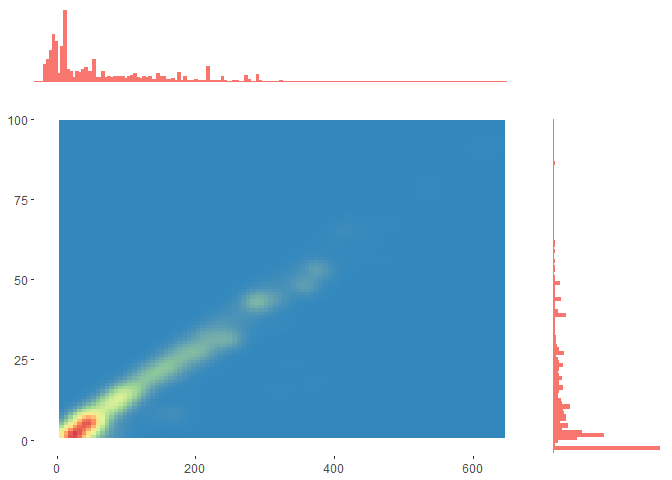
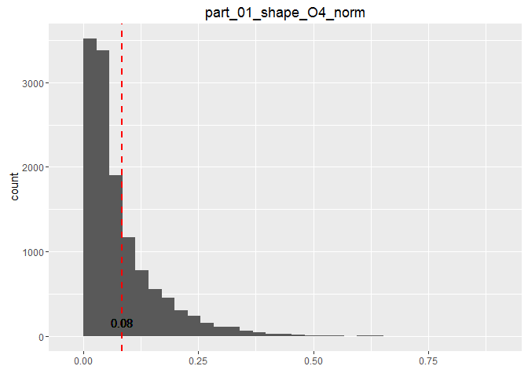

# Raport z analizy danych PDB
Maciej Łuczak 100908  
07-02-2016  

Ładowanie bibliotek
---

```r
library(knitr)
library(dplyr)
library(psych)
library(reshape2)
library(ggplot2)
library(gridExtra)
library(caret)
library(pls)
```

Powtarzalność raportu
---

```r
set.seed(23)
```

Wczytywanie danych
---

```r
rt <- read.table("all_summary.txt",header = TRUE, sep = ";", comment.char = "")
```

Usuwanie danych z błędnym res_name
---

```r
filtered1 <- rt %>%
       filter(!is.na(res_name)) %>%
       filter(!is.nan(res_name)) %>%
       filter(res_name != "DA",res_name !="DC",res_name !="DT", res_name !="DU",res_name != "DG", res_name !="DI",res_name !="UNK", res_name !="UNX", res_name !="UNL", res_name !="PR", res_name !="PD", res_name !="Y1", res_name !="EU", res_name !="N", res_name !="15P", res_name !="UQ", res_name !="PX4")
```

Usuwanie duplikatów par (pdb_code, res_name)
---

```r
distinct <- filtered1 %>% distinct(pdb_code, res_name)
```

Podsumowanie wartości w kolumnach
---

```r
knitr::kable(summary(distinct))
```

                title          pdb_code        res_name        res_id         chain_id      local_BAa       local_NPa        local_Ra       local_RGa       local_SRGa      local_CCSa      local_CCPa      local_ZOa       local_ZDa     local_ZD_minus_a   local_ZD_plus_a   local_res_atom_count   local_res_atom_non_h_count   local_res_atom_non_h_occupancy_sum   local_res_atom_non_h_electron_sum   local_res_atom_non_h_electron_occupancy_sum   local_res_atom_C_count   local_res_atom_N_count   local_res_atom_O_count   local_res_atom_S_count   dict_atom_non_h_count   dict_atom_non_h_electron_sum   dict_atom_C_count   dict_atom_N_count   dict_atom_O_count   dict_atom_S_count   part_00_blob_electron_sum   part_00_blob_volume_sum   part_00_blob_parts   part_00_shape_O3    part_00_shape_O4    part_00_shape_O5    part_00_shape_FL    part_00_shape_O3_norm   part_00_shape_O4_norm   part_00_shape_O5_norm   part_00_shape_FL_norm   part_00_shape_I1    part_00_shape_I2    part_00_shape_I3    part_00_shape_I4    part_00_shape_I5    part_00_shape_I6    part_00_shape_I1_norm   part_00_shape_I2_norm   part_00_shape_I3_norm   part_00_shape_I4_norm   part_00_shape_I5_norm   part_00_shape_I6_norm   part_00_shape_I1_scaled   part_00_shape_I2_scaled   part_00_shape_I3_scaled   part_00_shape_I4_scaled   part_00_shape_I5_scaled   part_00_shape_I6_scaled   part_00_shape_M000   part_00_shape_E3_E1   part_00_shape_E2_E1   part_00_shape_E3_E2   part_00_shape_sqrt_E1   part_00_shape_sqrt_E2   part_00_shape_sqrt_E3   part_00_density_O3   part_00_density_O4   part_00_density_O5   part_00_density_FL   part_00_density_O3_norm   part_00_density_O4_norm   part_00_density_O5_norm   part_00_density_FL_norm   part_00_density_I1   part_00_density_I2   part_00_density_I3   part_00_density_I4   part_00_density_I5   part_00_density_I6   part_00_density_I1_norm   part_00_density_I2_norm   part_00_density_I3_norm   part_00_density_I4_norm   part_00_density_I5_norm   part_00_density_I6_norm   part_00_density_I1_scaled   part_00_density_I2_scaled   part_00_density_I3_scaled   part_00_density_I4_scaled   part_00_density_I5_scaled   part_00_density_I6_scaled   part_00_density_M000   part_00_density_E3_E1   part_00_density_E2_E1   part_00_density_E3_E2   part_00_density_sqrt_E1   part_00_density_sqrt_E2   part_00_density_sqrt_E3   part_01_blob_electron_sum   part_01_blob_volume_sum   part_01_blob_parts   part_01_shape_O3    part_01_shape_O4    part_01_shape_O5    part_01_shape_FL    part_01_shape_O3_norm   part_01_shape_O4_norm   part_01_shape_O5_norm   part_01_shape_FL_norm   part_01_shape_I1    part_01_shape_I2    part_01_shape_I3    part_01_shape_I4    part_01_shape_I5    part_01_shape_I6    part_01_shape_I1_norm   part_01_shape_I2_norm   part_01_shape_I3_norm   part_01_shape_I4_norm   part_01_shape_I5_norm   part_01_shape_I6_norm   part_01_shape_I1_scaled   part_01_shape_I2_scaled   part_01_shape_I3_scaled   part_01_shape_I4_scaled   part_01_shape_I5_scaled   part_01_shape_I6_scaled   part_01_shape_M000   part_01_shape_E3_E1   part_01_shape_E2_E1   part_01_shape_E3_E2   part_01_shape_sqrt_E1   part_01_shape_sqrt_E2   part_01_shape_sqrt_E3   part_01_density_O3   part_01_density_O4   part_01_density_O5   part_01_density_FL   part_01_density_O3_norm   part_01_density_O4_norm   part_01_density_O5_norm   part_01_density_FL_norm   part_01_density_I1   part_01_density_I2   part_01_density_I3   part_01_density_I4   part_01_density_I5   part_01_density_I6   part_01_density_I1_norm   part_01_density_I2_norm   part_01_density_I3_norm   part_01_density_I4_norm   part_01_density_I5_norm   part_01_density_I6_norm   part_01_density_I1_scaled   part_01_density_I2_scaled   part_01_density_I3_scaled   part_01_density_I4_scaled   part_01_density_I5_scaled   part_01_density_I6_scaled   part_01_density_M000   part_01_density_E3_E1   part_01_density_E2_E1   part_01_density_E3_E2   part_01_density_sqrt_E1   part_01_density_sqrt_E2   part_01_density_sqrt_E3   part_02_blob_electron_sum   part_02_blob_volume_sum   part_02_blob_parts   part_02_shape_O3    part_02_shape_O4    part_02_shape_O5    part_02_shape_FL    part_02_shape_O3_norm   part_02_shape_O4_norm   part_02_shape_O5_norm   part_02_shape_FL_norm   part_02_shape_I1    part_02_shape_I2    part_02_shape_I3    part_02_shape_I4    part_02_shape_I5    part_02_shape_I6    part_02_shape_I1_norm   part_02_shape_I2_norm   part_02_shape_I3_norm   part_02_shape_I4_norm   part_02_shape_I5_norm   part_02_shape_I6_norm   part_02_shape_I1_scaled   part_02_shape_I2_scaled   part_02_shape_I3_scaled   part_02_shape_I4_scaled   part_02_shape_I5_scaled   part_02_shape_I6_scaled   part_02_shape_M000   part_02_shape_E3_E1   part_02_shape_E2_E1   part_02_shape_E3_E2   part_02_shape_sqrt_E1   part_02_shape_sqrt_E2   part_02_shape_sqrt_E3   part_02_density_O3   part_02_density_O4   part_02_density_O5   part_02_density_FL   part_02_density_O3_norm   part_02_density_O4_norm   part_02_density_O5_norm   part_02_density_FL_norm   part_02_density_I1   part_02_density_I2   part_02_density_I3   part_02_density_I4   part_02_density_I5   part_02_density_I6   part_02_density_I1_norm   part_02_density_I2_norm   part_02_density_I3_norm   part_02_density_I4_norm   part_02_density_I5_norm   part_02_density_I6_norm   part_02_density_I1_scaled   part_02_density_I2_scaled   part_02_density_I3_scaled   part_02_density_I4_scaled   part_02_density_I5_scaled   part_02_density_I6_scaled   part_02_density_M000   part_02_density_E3_E1   part_02_density_E2_E1   part_02_density_E3_E2   part_02_density_sqrt_E1   part_02_density_sqrt_E2   part_02_density_sqrt_E3   part_03_blob_electron_sum   part_03_blob_volume_sum   part_03_blob_parts   part_03_shape_O3    part_03_shape_O4    part_03_shape_O5    part_03_shape_FL    part_03_shape_O3_norm   part_03_shape_O4_norm   part_03_shape_O5_norm   part_03_shape_FL_norm   part_03_shape_I1    part_03_shape_I2    part_03_shape_I3    part_03_shape_I4    part_03_shape_I5    part_03_shape_I6    part_03_shape_I1_norm   part_03_shape_I2_norm   part_03_shape_I3_norm   part_03_shape_I4_norm   part_03_shape_I5_norm   part_03_shape_I6_norm   part_03_shape_I1_scaled   part_03_shape_I2_scaled   part_03_shape_I3_scaled   part_03_shape_I4_scaled   part_03_shape_I5_scaled   part_03_shape_I6_scaled   part_03_shape_M000   part_03_shape_E3_E1   part_03_shape_E2_E1   part_03_shape_E3_E2   part_03_shape_sqrt_E1   part_03_shape_sqrt_E2   part_03_shape_sqrt_E3   part_03_density_O3   part_03_density_O4   part_03_density_O5   part_03_density_FL   part_03_density_O3_norm   part_03_density_O4_norm   part_03_density_O5_norm   part_03_density_FL_norm   part_03_density_I1   part_03_density_I2   part_03_density_I3   part_03_density_I4   part_03_density_I5   part_03_density_I6   part_03_density_I1_norm   part_03_density_I2_norm   part_03_density_I3_norm   part_03_density_I4_norm   part_03_density_I5_norm   part_03_density_I6_norm   part_03_density_I1_scaled   part_03_density_I2_scaled   part_03_density_I3_scaled   part_03_density_I4_scaled   part_03_density_I5_scaled   part_03_density_I6_scaled   part_03_density_M000   part_03_density_E3_E1   part_03_density_E2_E1   part_03_density_E3_E2   part_03_density_sqrt_E1   part_03_density_sqrt_E2   part_03_density_sqrt_E3   part_04_blob_electron_sum   part_04_blob_volume_sum   part_04_blob_parts   part_04_shape_O3    part_04_shape_O4    part_04_shape_O5    part_04_shape_FL    part_04_shape_O3_norm   part_04_shape_O4_norm   part_04_shape_O5_norm   part_04_shape_FL_norm   part_04_shape_I1    part_04_shape_I2    part_04_shape_I3    part_04_shape_I4    part_04_shape_I5    part_04_shape_I6    part_04_shape_I1_norm   part_04_shape_I2_norm   part_04_shape_I3_norm   part_04_shape_I4_norm   part_04_shape_I5_norm   part_04_shape_I6_norm   part_04_shape_I1_scaled   part_04_shape_I2_scaled   part_04_shape_I3_scaled   part_04_shape_I4_scaled   part_04_shape_I5_scaled   part_04_shape_I6_scaled   part_04_shape_M000   part_04_shape_E3_E1   part_04_shape_E2_E1   part_04_shape_E3_E2   part_04_shape_sqrt_E1   part_04_shape_sqrt_E2   part_04_shape_sqrt_E3   part_04_density_O3   part_04_density_O4   part_04_density_O5   part_04_density_FL   part_04_density_O3_norm   part_04_density_O4_norm   part_04_density_O5_norm   part_04_density_FL_norm   part_04_density_I1   part_04_density_I2   part_04_density_I3   part_04_density_I4   part_04_density_I5   part_04_density_I6   part_04_density_I1_norm   part_04_density_I2_norm   part_04_density_I3_norm   part_04_density_I4_norm   part_04_density_I5_norm   part_04_density_I6_norm   part_04_density_I1_scaled   part_04_density_I2_scaled   part_04_density_I3_scaled   part_04_density_I4_scaled   part_04_density_I5_scaled   part_04_density_I6_scaled   part_04_density_M000   part_04_density_E3_E1   part_04_density_E2_E1   part_04_density_E3_E2   part_04_density_sqrt_E1   part_04_density_sqrt_E2   part_04_density_sqrt_E3   part_05_blob_electron_sum   part_05_blob_volume_sum   part_05_blob_parts   part_05_shape_O3    part_05_shape_O4    part_05_shape_O5    part_05_shape_FL    part_05_shape_O3_norm   part_05_shape_O4_norm   part_05_shape_O5_norm   part_05_shape_FL_norm   part_05_shape_I1    part_05_shape_I2    part_05_shape_I3    part_05_shape_I4    part_05_shape_I5    part_05_shape_I6    part_05_shape_I1_norm   part_05_shape_I2_norm   part_05_shape_I3_norm   part_05_shape_I4_norm   part_05_shape_I5_norm   part_05_shape_I6_norm   part_05_shape_I1_scaled   part_05_shape_I2_scaled   part_05_shape_I3_scaled   part_05_shape_I4_scaled   part_05_shape_I5_scaled   part_05_shape_I6_scaled   part_05_shape_M000   part_05_shape_E3_E1   part_05_shape_E2_E1   part_05_shape_E3_E2   part_05_shape_sqrt_E1   part_05_shape_sqrt_E2   part_05_shape_sqrt_E3   part_05_density_O3   part_05_density_O4   part_05_density_O5   part_05_density_FL   part_05_density_O3_norm   part_05_density_O4_norm   part_05_density_O5_norm   part_05_density_FL_norm   part_05_density_I1   part_05_density_I2   part_05_density_I3   part_05_density_I4   part_05_density_I5   part_05_density_I6   part_05_density_I1_norm   part_05_density_I2_norm   part_05_density_I3_norm   part_05_density_I4_norm   part_05_density_I5_norm   part_05_density_I6_norm   part_05_density_I1_scaled   part_05_density_I2_scaled   part_05_density_I3_scaled   part_05_density_I4_scaled   part_05_density_I5_scaled   part_05_density_I6_scaled   part_05_density_M000   part_05_density_E3_E1   part_05_density_E2_E1   part_05_density_E3_E2   part_05_density_sqrt_E1   part_05_density_sqrt_E2   part_05_density_sqrt_E3   part_06_blob_electron_sum   part_06_blob_volume_sum   part_06_blob_parts   part_06_shape_O3    part_06_shape_O4    part_06_shape_O5    part_06_shape_FL    part_06_shape_O3_norm   part_06_shape_O4_norm   part_06_shape_O5_norm   part_06_shape_FL_norm   part_06_shape_I1    part_06_shape_I2    part_06_shape_I3    part_06_shape_I4    part_06_shape_I5    part_06_shape_I6    part_06_shape_I1_norm   part_06_shape_I2_norm   part_06_shape_I3_norm   part_06_shape_I4_norm   part_06_shape_I5_norm   part_06_shape_I6_norm   part_06_shape_I1_scaled   part_06_shape_I2_scaled   part_06_shape_I3_scaled   part_06_shape_I4_scaled   part_06_shape_I5_scaled   part_06_shape_I6_scaled   part_06_shape_M000   part_06_shape_E3_E1   part_06_shape_E2_E1   part_06_shape_E3_E2   part_06_shape_sqrt_E1   part_06_shape_sqrt_E2   part_06_shape_sqrt_E3   part_06_density_O3   part_06_density_O4   part_06_density_O5   part_06_density_FL   part_06_density_O3_norm   part_06_density_O4_norm   part_06_density_O5_norm   part_06_density_FL_norm   part_06_density_I1   part_06_density_I2   part_06_density_I3   part_06_density_I4   part_06_density_I5   part_06_density_I6   part_06_density_I1_norm   part_06_density_I2_norm   part_06_density_I3_norm   part_06_density_I4_norm   part_06_density_I5_norm   part_06_density_I6_norm   part_06_density_I1_scaled   part_06_density_I2_scaled   part_06_density_I3_scaled   part_06_density_I4_scaled   part_06_density_I5_scaled   part_06_density_I6_scaled   part_06_density_M000   part_06_density_E3_E1   part_06_density_E2_E1   part_06_density_E3_E2   part_06_density_sqrt_E1   part_06_density_sqrt_E2   part_06_density_sqrt_E3   part_07_blob_electron_sum   part_07_blob_volume_sum   part_07_blob_parts   part_07_shape_O3    part_07_shape_O4    part_07_shape_O5    part_07_shape_FL    part_07_shape_O3_norm   part_07_shape_O4_norm   part_07_shape_O5_norm   part_07_shape_FL_norm   part_07_shape_I1    part_07_shape_I2    part_07_shape_I3    part_07_shape_I4    part_07_shape_I5    part_07_shape_I6    part_07_shape_I1_norm   part_07_shape_I2_norm   part_07_shape_I3_norm   part_07_shape_I4_norm   part_07_shape_I5_norm   part_07_shape_I6_norm   part_07_shape_I1_scaled   part_07_shape_I2_scaled   part_07_shape_I3_scaled   part_07_shape_I4_scaled   part_07_shape_I5_scaled   part_07_shape_I6_scaled   part_07_shape_M000   part_07_shape_E3_E1   part_07_shape_E2_E1   part_07_shape_E3_E2   part_07_shape_sqrt_E1   part_07_shape_sqrt_E2   part_07_shape_sqrt_E3   part_07_density_O3   part_07_density_O4   part_07_density_O5   part_07_density_FL   part_07_density_O3_norm   part_07_density_O4_norm   part_07_density_O5_norm   part_07_density_FL_norm   part_07_density_I1   part_07_density_I2   part_07_density_I3   part_07_density_I4   part_07_density_I5   part_07_density_I6   part_07_density_I1_norm   part_07_density_I2_norm   part_07_density_I3_norm   part_07_density_I4_norm   part_07_density_I5_norm   part_07_density_I6_norm   part_07_density_I1_scaled   part_07_density_I2_scaled   part_07_density_I3_scaled   part_07_density_I4_scaled   part_07_density_I5_scaled   part_07_density_I6_scaled   part_07_density_M000   part_07_density_E3_E1   part_07_density_E2_E1   part_07_density_E3_E2   part_07_density_sqrt_E1   part_07_density_sqrt_E2   part_07_density_sqrt_E3   part_08_blob_electron_sum   part_08_blob_volume_sum   part_08_blob_parts   part_08_shape_O3   part_08_shape_O4    part_08_shape_O5    part_08_shape_FL    part_08_shape_O3_norm   part_08_shape_O4_norm   part_08_shape_O5_norm   part_08_shape_FL_norm   part_08_shape_I1    part_08_shape_I2    part_08_shape_I3    part_08_shape_I4    part_08_shape_I5    part_08_shape_I6    part_08_shape_I1_norm   part_08_shape_I2_norm   part_08_shape_I3_norm   part_08_shape_I4_norm   part_08_shape_I5_norm   part_08_shape_I6_norm   part_08_shape_I1_scaled   part_08_shape_I2_scaled   part_08_shape_I3_scaled   part_08_shape_I4_scaled   part_08_shape_I5_scaled   part_08_shape_I6_scaled   part_08_shape_M000   part_08_shape_E3_E1   part_08_shape_E2_E1   part_08_shape_E3_E2   part_08_shape_sqrt_E1   part_08_shape_sqrt_E2   part_08_shape_sqrt_E3   part_08_density_O3   part_08_density_O4   part_08_density_O5   part_08_density_FL   part_08_density_O3_norm   part_08_density_O4_norm   part_08_density_O5_norm   part_08_density_FL_norm   part_08_density_I1   part_08_density_I2   part_08_density_I3   part_08_density_I4   part_08_density_I5   part_08_density_I6   part_08_density_I1_norm   part_08_density_I2_norm   part_08_density_I3_norm   part_08_density_I4_norm   part_08_density_I5_norm   part_08_density_I6_norm   part_08_density_I1_scaled   part_08_density_I2_scaled   part_08_density_I3_scaled   part_08_density_I4_scaled   part_08_density_I5_scaled   part_08_density_I6_scaled   part_08_density_M000   part_08_density_E3_E1   part_08_density_E2_E1   part_08_density_E3_E2   part_08_density_sqrt_E1   part_08_density_sqrt_E2   part_08_density_sqrt_E3   part_09_blob_electron_sum   part_09_blob_volume_sum   part_09_blob_parts   part_09_shape_O3   part_09_shape_O4    part_09_shape_O5    part_09_shape_FL    part_09_shape_O3_norm   part_09_shape_O4_norm   part_09_shape_O5_norm   part_09_shape_FL_norm   part_09_shape_I1    part_09_shape_I2    part_09_shape_I3    part_09_shape_I4    part_09_shape_I5    part_09_shape_I6    part_09_shape_I1_norm   part_09_shape_I2_norm   part_09_shape_I3_norm   part_09_shape_I4_norm   part_09_shape_I5_norm   part_09_shape_I6_norm   part_09_shape_I1_scaled   part_09_shape_I2_scaled   part_09_shape_I3_scaled   part_09_shape_I4_scaled   part_09_shape_I5_scaled   part_09_shape_I6_scaled   part_09_shape_M000   part_09_shape_E3_E1   part_09_shape_E2_E1   part_09_shape_E3_E2   part_09_shape_sqrt_E1   part_09_shape_sqrt_E2   part_09_shape_sqrt_E3   part_09_density_O3   part_09_density_O4   part_09_density_O5   part_09_density_FL   part_09_density_O3_norm   part_09_density_O4_norm   part_09_density_O5_norm   part_09_density_FL_norm   part_09_density_I1   part_09_density_I2   part_09_density_I3   part_09_density_I4   part_09_density_I5   part_09_density_I6   part_09_density_I1_norm   part_09_density_I2_norm   part_09_density_I3_norm   part_09_density_I4_norm   part_09_density_I5_norm   part_09_density_I6_norm   part_09_density_I1_scaled   part_09_density_I2_scaled   part_09_density_I3_scaled   part_09_density_I4_scaled   part_09_density_I5_scaled   part_09_density_I6_scaled   part_09_density_M000   part_09_density_E3_E1   part_09_density_E2_E1   part_09_density_E3_E2   part_09_density_sqrt_E1   part_09_density_sqrt_E2   part_09_density_sqrt_E3    local_volume      local_electrons     local_mean        local_std        local_min     local_max       local_skewness    local_parts        fo_col          fc_col      weight_col       grid_space   solvent_radius   solvent_opening_radius   resolution_max_limit     resolution     TwoFoFc_mean         TwoFoFc_std       TwoFoFc_square_std    TwoFoFc_min       TwoFoFc_max         Fo_mean               Fo_std        Fo_square_std          Fo_min            Fo_max          FoFc_mean             FoFc_std        FoFc_square_std        FoFc_min            FoFc_max           Fc_mean               Fc_std         Fc_square_std          Fc_min            Fc_max        solvent_mask_count   void_mask_count    modeled_mask_count   solvent_ratio    TwoFoFc_bulk_mean   TwoFoFc_bulk_std   TwoFoFc_void_mean    TwoFoFc_void_std   TwoFoFc_modeled_mean   TwoFoFc_modeled_std    Fo_bulk_mean       Fo_bulk_std       Fo_void_mean       Fo_void_std      Fo_modeled_mean     Fo_modeled_std    FoFc_bulk_mean     FoFc_bulk_std     FoFc_void_mean      FoFc_void_std     FoFc_modeled_mean   FoFc_modeled_std    Fc_bulk_mean       Fc_bulk_std       Fc_void_mean        Fc_void_std      Fc_modeled_mean     Fc_modeled_std    TwoFoFc_void_fit_binormal_mean1   TwoFoFc_void_fit_binormal_std1   TwoFoFc_void_fit_binormal_mean2   TwoFoFc_void_fit_binormal_std2   TwoFoFc_void_fit_binormal_scale   TwoFoFc_solvent_fit_normal_mean   TwoFoFc_solvent_fit_normal_std   part_step_FoFc_std_min   part_step_FoFc_std_max   part_step_FoFc_std_step 
---  ---------------------  --------------  -------------  --------------  -------------  --------------  --------------  --------------  --------------  --------------  --------------  --------------  --------------  --------------  -----------------  ----------------  ---------------------  ---------------------------  -----------------------------------  ----------------------------------  --------------------------------------------  -----------------------  -----------------------  -----------------------  -----------------------  ----------------------  -----------------------------  ------------------  ------------------  ------------------  ------------------  --------------------------  ------------------------  -------------------  ------------------  ------------------  ------------------  ------------------  ----------------------  ----------------------  ----------------------  ----------------------  ------------------  ------------------  ------------------  ------------------  ------------------  ------------------  ----------------------  ----------------------  ----------------------  ----------------------  ----------------------  ----------------------  ------------------------  ------------------------  ------------------------  ------------------------  ------------------------  ------------------------  -------------------  --------------------  --------------------  --------------------  ----------------------  ----------------------  ----------------------  -------------------  -------------------  -------------------  -------------------  ------------------------  ------------------------  ------------------------  ------------------------  -------------------  -------------------  -------------------  -------------------  -------------------  -------------------  ------------------------  ------------------------  ------------------------  ------------------------  ------------------------  ------------------------  --------------------------  --------------------------  --------------------------  --------------------------  --------------------------  --------------------------  ---------------------  ----------------------  ----------------------  ----------------------  ------------------------  ------------------------  ------------------------  --------------------------  ------------------------  -------------------  ------------------  ------------------  ------------------  ------------------  ----------------------  ----------------------  ----------------------  ----------------------  ------------------  ------------------  ------------------  ------------------  ------------------  ------------------  ----------------------  ----------------------  ----------------------  ----------------------  ----------------------  ----------------------  ------------------------  ------------------------  ------------------------  ------------------------  ------------------------  ------------------------  -------------------  --------------------  --------------------  --------------------  ----------------------  ----------------------  ----------------------  -------------------  -------------------  -------------------  -------------------  ------------------------  ------------------------  ------------------------  ------------------------  -------------------  -------------------  -------------------  -------------------  -------------------  -------------------  ------------------------  ------------------------  ------------------------  ------------------------  ------------------------  ------------------------  --------------------------  --------------------------  --------------------------  --------------------------  --------------------------  --------------------------  ---------------------  ----------------------  ----------------------  ----------------------  ------------------------  ------------------------  ------------------------  --------------------------  ------------------------  -------------------  ------------------  ------------------  ------------------  ------------------  ----------------------  ----------------------  ----------------------  ----------------------  ------------------  ------------------  ------------------  ------------------  ------------------  ------------------  ----------------------  ----------------------  ----------------------  ----------------------  ----------------------  ----------------------  ------------------------  ------------------------  ------------------------  ------------------------  ------------------------  ------------------------  -------------------  --------------------  --------------------  --------------------  ----------------------  ----------------------  ----------------------  -------------------  -------------------  -------------------  -------------------  ------------------------  ------------------------  ------------------------  ------------------------  -------------------  -------------------  -------------------  -------------------  -------------------  -------------------  ------------------------  ------------------------  ------------------------  ------------------------  ------------------------  ------------------------  --------------------------  --------------------------  --------------------------  --------------------------  --------------------------  --------------------------  ---------------------  ----------------------  ----------------------  ----------------------  ------------------------  ------------------------  ------------------------  --------------------------  ------------------------  -------------------  ------------------  ------------------  ------------------  ------------------  ----------------------  ----------------------  ----------------------  ----------------------  ------------------  ------------------  ------------------  ------------------  ------------------  ------------------  ----------------------  ----------------------  ----------------------  ----------------------  ----------------------  ----------------------  ------------------------  ------------------------  ------------------------  ------------------------  ------------------------  ------------------------  -------------------  --------------------  --------------------  --------------------  ----------------------  ----------------------  ----------------------  -------------------  -------------------  -------------------  -------------------  ------------------------  ------------------------  ------------------------  ------------------------  -------------------  -------------------  -------------------  -------------------  -------------------  -------------------  ------------------------  ------------------------  ------------------------  ------------------------  ------------------------  ------------------------  --------------------------  --------------------------  --------------------------  --------------------------  --------------------------  --------------------------  ---------------------  ----------------------  ----------------------  ----------------------  ------------------------  ------------------------  ------------------------  --------------------------  ------------------------  -------------------  ------------------  ------------------  ------------------  ------------------  ----------------------  ----------------------  ----------------------  ----------------------  ------------------  ------------------  ------------------  ------------------  ------------------  ------------------  ----------------------  ----------------------  ----------------------  ----------------------  ----------------------  ----------------------  ------------------------  ------------------------  ------------------------  ------------------------  ------------------------  ------------------------  -------------------  --------------------  --------------------  --------------------  ----------------------  ----------------------  ----------------------  -------------------  -------------------  -------------------  -------------------  ------------------------  ------------------------  ------------------------  ------------------------  -------------------  -------------------  -------------------  -------------------  -------------------  -------------------  ------------------------  ------------------------  ------------------------  ------------------------  ------------------------  ------------------------  --------------------------  --------------------------  --------------------------  --------------------------  --------------------------  --------------------------  ---------------------  ----------------------  ----------------------  ----------------------  ------------------------  ------------------------  ------------------------  --------------------------  ------------------------  -------------------  ------------------  ------------------  ------------------  ------------------  ----------------------  ----------------------  ----------------------  ----------------------  ------------------  ------------------  ------------------  ------------------  ------------------  ------------------  ----------------------  ----------------------  ----------------------  ----------------------  ----------------------  ----------------------  ------------------------  ------------------------  ------------------------  ------------------------  ------------------------  ------------------------  -------------------  --------------------  --------------------  --------------------  ----------------------  ----------------------  ----------------------  -------------------  -------------------  -------------------  -------------------  ------------------------  ------------------------  ------------------------  ------------------------  -------------------  -------------------  -------------------  -------------------  -------------------  -------------------  ------------------------  ------------------------  ------------------------  ------------------------  ------------------------  ------------------------  --------------------------  --------------------------  --------------------------  --------------------------  --------------------------  --------------------------  ---------------------  ----------------------  ----------------------  ----------------------  ------------------------  ------------------------  ------------------------  --------------------------  ------------------------  -------------------  ------------------  ------------------  ------------------  ------------------  ----------------------  ----------------------  ----------------------  ----------------------  ------------------  ------------------  ------------------  ------------------  ------------------  ------------------  ----------------------  ----------------------  ----------------------  ----------------------  ----------------------  ----------------------  ------------------------  ------------------------  ------------------------  ------------------------  ------------------------  ------------------------  -------------------  --------------------  --------------------  --------------------  ----------------------  ----------------------  ----------------------  -------------------  -------------------  -------------------  -------------------  ------------------------  ------------------------  ------------------------  ------------------------  -------------------  -------------------  -------------------  -------------------  -------------------  -------------------  ------------------------  ------------------------  ------------------------  ------------------------  ------------------------  ------------------------  --------------------------  --------------------------  --------------------------  --------------------------  --------------------------  --------------------------  ---------------------  ----------------------  ----------------------  ----------------------  ------------------------  ------------------------  ------------------------  --------------------------  ------------------------  -------------------  ------------------  ------------------  ------------------  ------------------  ----------------------  ----------------------  ----------------------  ----------------------  ------------------  ------------------  ------------------  ------------------  ------------------  ------------------  ----------------------  ----------------------  ----------------------  ----------------------  ----------------------  ----------------------  ------------------------  ------------------------  ------------------------  ------------------------  ------------------------  ------------------------  -------------------  --------------------  --------------------  --------------------  ----------------------  ----------------------  ----------------------  -------------------  -------------------  -------------------  -------------------  ------------------------  ------------------------  ------------------------  ------------------------  -------------------  -------------------  -------------------  -------------------  -------------------  -------------------  ------------------------  ------------------------  ------------------------  ------------------------  ------------------------  ------------------------  --------------------------  --------------------------  --------------------------  --------------------------  --------------------------  --------------------------  ---------------------  ----------------------  ----------------------  ----------------------  ------------------------  ------------------------  ------------------------  --------------------------  ------------------------  -------------------  -----------------  ------------------  ------------------  ------------------  ----------------------  ----------------------  ----------------------  ----------------------  ------------------  ------------------  ------------------  ------------------  ------------------  ------------------  ----------------------  ----------------------  ----------------------  ----------------------  ----------------------  ----------------------  ------------------------  ------------------------  ------------------------  ------------------------  ------------------------  ------------------------  -------------------  --------------------  --------------------  --------------------  ----------------------  ----------------------  ----------------------  -------------------  -------------------  -------------------  -------------------  ------------------------  ------------------------  ------------------------  ------------------------  -------------------  -------------------  -------------------  -------------------  -------------------  -------------------  ------------------------  ------------------------  ------------------------  ------------------------  ------------------------  ------------------------  --------------------------  --------------------------  --------------------------  --------------------------  --------------------------  --------------------------  ---------------------  ----------------------  ----------------------  ----------------------  ------------------------  ------------------------  ------------------------  --------------------------  ------------------------  -------------------  -----------------  ------------------  ------------------  ------------------  ----------------------  ----------------------  ----------------------  ----------------------  ------------------  ------------------  ------------------  ------------------  ------------------  ------------------  ----------------------  ----------------------  ----------------------  ----------------------  ----------------------  ----------------------  ------------------------  ------------------------  ------------------------  ------------------------  ------------------------  ------------------------  -------------------  --------------------  --------------------  --------------------  ----------------------  ----------------------  ----------------------  -------------------  -------------------  -------------------  -------------------  ------------------------  ------------------------  ------------------------  ------------------------  -------------------  -------------------  -------------------  -------------------  -------------------  -------------------  ------------------------  ------------------------  ------------------------  ------------------------  ------------------------  ------------------------  --------------------------  --------------------------  --------------------------  --------------------------  --------------------------  --------------------------  ---------------------  ----------------------  ----------------------  ----------------------  ------------------------  ------------------------  ------------------------  -----------------  ----------------  ----------------  ---------------  ------------  ----------------  ---------------  ---------------  -------------  --------------  -------------  -------------  ---------------  -----------------------  ---------------------  --------------  -------------------  -----------------  -------------------  ----------------  ----------------  -------------------  ----------------  -----------------  ----------------  ----------------  -------------------  -----------------  ------------------  ------------------  -----------------  -------------------  -----------------  -----------------  ----------------  ----------------  -------------------  -----------------  -------------------  ---------------  ------------------  -----------------  -------------------  -----------------  ---------------------  --------------------  -----------------  ----------------  -----------------  ----------------  ------------------  ----------------  -----------------  ----------------  ------------------  ----------------  ------------------  -----------------  -----------------  ----------------  ------------------  ----------------  ------------------  ----------------  --------------------------------  -------------------------------  --------------------------------  -------------------------------  --------------------------------  --------------------------------  -------------------------------  -----------------------  -----------------------  ------------------------
     110l BME 901 A:    1   3ag4   :   15   SO4    :1183   301    :  425   A      :8490   Min.   : NA     Min.   : NA     Min.   : NA     Min.   : NA     Min.   : NA     Min.   : NA     Min.   : NA     Min.   : NA     Min.   : NA     Min.   : NA        Min.   : NA       Min.   :  1.00         Min.   :  1.00               Min.   :  0.000                      Min.   :  3.0                       Min.   :  0.00                                Min.   : 0.000           Min.   : 0.000           Min.   : 0.000           Min.   :0.0000           Min.   :  1.00          Min.   :  3.0                  Min.   : 0.000      Min.   : 0.00       Min.   : 0.000      Min.   :0.0000      Min.   :  0.000             Min.   :   0.00           Min.   :0.0000       Min.   :    24253   Min.   :1.952e+08   Min.   :5.160e+11   Min.   :3.330e+06   Min.   :0.2312          Min.   :0.0178          Min.   :0.0005          Min.   :0.0000          Min.   :6.875e+05   Min.   :1.246e+11   Min.   :9.688e+10   Min.   :1.335e+06   Min.   :4.728e+03   Min.   :5.618e+09   Min.   : 0.0637         Min.   : 0.0011         Min.   :  0.0008        Min.   :0.0000          Min.   :0.0000          Min.   : 0.0049         Min.   :0.0001            Min.   :0.0000            Min.   :0.0000            Min.   :0.0000            Min.   :0e+00             Min.   :0                 Min.   :  1023       Min.   :0.0005        Min.   :0.0142        Min.   :0.0042        Min.   : 2.930          Min.   : 1.793          Min.   : 0.498          Min.   :     1527    Min.   :7.096e+05    Min.   :1.011e+08    Min.   :9.595e+05    Min.   :0.0593            Min.   :0.0012            Min.   :0.0000            Min.   : 0.0000           Min.   :6.548e+04    Min.   :9.611e+08    Min.   :1.275e+09    Min.   :4.130e+05    Min.   :2.366e+04    Min.   :3.899e+07    Min.   : 0.0048           Min.   :  0.0000          Min.   :   0.0000         Min.   : 0.0000           Min.   : 0.0000           Min.   :  0.0001          Min.   :0.0000              Min.   :0.0000              Min.   :0.0000              Min.   :0.0000              Min.   :0.0000              Min.   :0.0000              Min.   :   47          Min.   :0.0007          Min.   :0.0133          Min.   :0.0052          Min.   : 2.499            Min.   : 1.769            Min.   : 0.4972           Min.   :  0.000             Min.   :   0.00           Min.   :0.0000       Min.   :    24186   Min.   :1.947e+08   Min.   :5.217e+11   Min.   :2.023e+06   Min.   :0.2313          Min.   :0.0178          Min.   :0.0005          Min.   :0.0000          Min.   :6.807e+05   Min.   :1.231e+11   Min.   :9.354e+10   Min.   :8.184e+05   Min.   :3.360e+03   Min.   :5.502e+09   Min.   : 0.0637         Min.   : 0.0011         Min.   :  0.0008        Min.   :0.0000          Min.   :0.0000          Min.   : 0.0049         Min.   :0.0001            Min.   :0.0000            Min.   :0.000             Min.   :0.0000            Min.   :0.000             Min.   :0                 Min.   :  1023       Min.   :0.0005        Min.   :0.0127        Min.   :0.0044        Min.   : 2.898          Min.   : 1.947          Min.   : 0.4978         Min.   :    1038     Min.   :3.280e+05    Min.   :3.182e+07    Min.   :3.230e+05    Min.   :0.0592            Min.   :0.0012            Min.   :0.0000            Min.   : 0.0000           Min.   :3.748e+04    Min.   :3.151e+08    Min.   :4.195e+08    Min.   :1.414e+05    Min.   :2.029e+04    Min.   :1.512e+07    Min.   : 0.0048           Min.   :  0.0000          Min.   :   0.000          Min.   : 0.0000           Min.   : 0.0000           Min.   :  0.0001          Min.   :0.0000              Min.   :0.0000              Min.   :0.0000              Min.   :0.0000              Min.   :0.0000              Min.   :0.0000              Min.   :   37.76       Min.   :0.0007          Min.   :0.0122          Min.   :0.0054          Min.   : 2.496            Min.   : 1.877            Min.   : 0.4971           Min.   :  0.000             Min.   :   0.000          Min.   :0.0000       Min.   :    24331   Min.   :1.955e+08   Min.   :5.180e+11   Min.   :2.142e+06   Min.   :0.2312          Min.   :0.0178          Min.   :0.0005          Min.   : 0.0000         Min.   :6.937e+05   Min.   :1.254e+11   Min.   :1.013e+11   Min.   :8.662e+05   Min.   :3.121e+03   Min.   :5.751e+09   Min.   : 0.0637         Min.   : 0.0011         Min.   :  0.0008        Min.   : 0.0000         Min.   : 0.0000         Min.   : 0.0049         Min.   :0.0001            Min.   :0.0000            Min.   :0.0000            Min.   :0.0000            Min.   :0.0000            Min.   :0                 Min.   :  1023       Min.   :0.0006        Min.   :0.0138        Min.   :0.0047        Min.   : 2.917          Min.   : 1.914          Min.   : 0.4957         Min.   :    4269     Min.   :5.654e+06    Min.   :2.385e+09    Min.   :1.443e+06    Min.   :0.0588            Min.   :0.0011            Min.   :0.0000            Min.   :  0.0000          Min.   :1.324e+05    Min.   :3.851e+09    Min.   :4.897e+09    Min.   :6.988e+05    Min.   :1.294e+04    Min.   :2.080e+08    Min.   : 0.0047           Min.   :  0.0000          Min.   :   0.000          Min.   :  0.0000          Min.   :  0.0000          Min.   :  0.0001          Min.   :0.0000              Min.   :0.0000              Min.   :0.0000              Min.   :0.0000              Min.   :0.0000              Min.   :0.0000              Min.   :  177.5        Min.   :0.0008          Min.   :0.0138          Min.   :0.0058          Min.   : 2.487            Min.   : 1.857            Min.   : 0.4957           Min.   :  0.00              Min.   :  0.00            Min.   :0.0000       Min.   :    24164   Min.   :1.941e+08   Min.   :5.143e+11   Min.   :6.027e+06   Min.   :0.231           Min.   :0.018           Min.   :0.000           Min.   : 0.000          Min.   :6.790e+05   Min.   :1.225e+11   Min.   :9.315e+10   Min.   :2.433e+06   Min.   :1.301e+03   Min.   :5.484e+09   Min.   : 0.064          Min.   : 0.001          Min.   :  0.001         Min.   : 0.000          Min.   : 0.000          Min.   : 0.005          Min.   :0.000             Min.   :0.000             Min.   :0.00              Min.   :0.000             Min.   :0.000             Min.   :0                 Min.   :  1023       Min.   :0.001         Min.   :0.012         Min.   :0.005         Min.   : 2.884          Min.   : 1.817          Min.   : 0.493          Min.   :    4027     Min.   :5.262e+06    Min.   :2.243e+09    Min.   :1.389e+06    Min.   : 0.058            Min.   : 0.001            Min.   :0.000             Min.   :  0.000           Min.   :1.186e+05    Min.   :3.489e+09    Min.   :3.239e+09    Min.   :5.853e+05    Min.   :1.301e+04    Min.   :1.669e+08    Min.   :  0.005           Min.   :   0.000          Min.   :    0.00          Min.   :  0.000           Min.   :  0.000           Min.   :   0.000          Min.   :0.000               Min.   :0.000               Min.   : 0.000              Min.   :0.00                Min.   :0.000               Min.   :0.000               Min.   :  168          Min.   :0.001           Min.   :0.011           Min.   :0.006           Min.   : 2.473            Min.   : 1.773            Min.   : 0.494            Min.   :  0.000             Min.   :  0.00            Min.   :0.0000       Min.   :    24198   Min.   :1.946e+08   Min.   :5.198e+11   Min.   :7.913e+06   Min.   :0.231           Min.   :0.018           Min.   :0.000           Min.   : 0.000          Min.   :6.817e+05   Min.   :1.231e+11   Min.   :9.400e+10   Min.   :3.183e+06   Min.   :3.774e+03   Min.   :5.528e+09   Min.   : 0.064          Min.   :  0.001         Min.   :   0.001        Min.   : 0.000          Min.   : 0.000          Min.   :  0.005         Min.   :0.000             Min.   :0.000             Min.   :0.000             Min.   :0.000             Min.   :0.000             Min.   :0                 Min.   : 1023        Min.   :0.001         Min.   :0.009         Min.   :0.010         Min.   : 2.869          Min.   : 1.644          Min.   : 0.496          Min.   :    6632     Min.   :1.333e+07    Min.   :7.807e+09    Min.   :1.426e+06    Min.   : 0.058            Min.   : 0.001            Min.   :0.000             Min.   :   0.000          Min.   :2.208e+05    Min.   :1.088e+10    Min.   :1.331e+10    Min.   :5.746e+05    Min.   :3.000e+00    Min.   :5.871e+08    Min.   :  0.005           Min.   :   0.000          Min.   :     0.00         Min.   :   0.000          Min.   :   0.000          Min.   :   0.000          Min.   :0.000               Min.   :0.000               Min.   :0.000               Min.   :0.000               Min.   :0.000               Min.   :0.000               Min.   :  260.4        Min.   :0.001           Min.   :0.008           Min.   :0.011           Min.   : 2.577            Min.   : 1.617            Min.   : 0.497            Min.   :  0.000             Min.   :  0.000           Min.   :0.000        Min.   :    24236   Min.   :1.956e+08   Min.   :5.224e+11   Min.   :4.696e+06   Min.   :0.231           Min.   :0.018           Min.   :0.000           Min.   :  0.000         Min.   :6.861e+05   Min.   :1.254e+11   Min.   :9.477e+10   Min.   :1.895e+06   Min.   :5.507e+03   Min.   :5.553e+09   Min.   : 0.064          Min.   : 0.001          Min.   :   0.001        Min.   :  0.000         Min.   :  0.000         Min.   :  0.005         Min.   :0.000             Min.   :0.000             Min.   :0.000             Min.   :0.000             Min.   :0.000             Min.   :0                 Min.   : 1023        Min.   :0.001         Min.   :0.008         Min.   :0.011         Min.   : 2.866          Min.   : 2.056          Min.   : 0.496          Min.   :    6245     Min.   :1.195e+07    Min.   :6.600e+09    Min.   :8.006e+05    Min.   : 0.058            Min.   :0.001             Min.   :0.000             Min.   :   0.000          Min.   :1.955e+05    Min.   :9.819e+09    Min.   :8.451e+09    Min.   :3.227e+05    Min.   :4.053e+03    Min.   :4.207e+08    Min.   :  0.005           Min.   :  0.000           Min.   :     0.0          Min.   :   0.000          Min.   :   0.000          Min.   :    0.000         Min.   :0.000               Min.   :0.000               Min.   : 0.000              Min.   :0.000               Min.   :0.000               Min.   :0.000               Min.   :  237.1        Min.   :0.001           Min.   :0.008           Min.   :0.013           Min.   : 2.538            Min.   : 1.980            Min.   : 0.496            Min.   :  0.00              Min.   :  0.00            Min.   :0.0000       Min.   :    24358   Min.   :1.971e+08   Min.   :5.177e+11   Min.   :7.396e+06   Min.   : 0.231          Min.   :0.018           Min.   :0.000           Min.   : 0.000          Min.   :6.850e+05   Min.   :1.250e+11   Min.   :9.408e+10   Min.   :2.975e+06   Min.   :4.763e+03   Min.   :5.566e+09   Min.   :  0.064         Min.   :   0.001        Min.   :    0.001       Min.   :  0.000         Min.   :  0.000         Min.   :   0.005        Min.   :0.000             Min.   :0.000             Min.   :0.000             Min.   :0.00              Min.   :0.000             Min.   :0                 Min.   : 1023        Min.   :0.001         Min.   :0.008         Min.   :0.012         Min.   : 2.853          Min.   : 2.037          Min.   : 0.496          Min.   :    6900     Min.   :1.522e+07    Min.   :1.075e+10    Min.   :2.231e+06    Min.   : 0.057            Min.   :0.001             Min.   :0.000             Min.   :  0.000           Min.   :2.044e+05    Min.   :1.033e+10    Min.   :1.034e+10    Min.   :8.939e+05    Min.   :2.507e+03    Min.   :5.106e+08    Min.   :  0.004           Min.   :    0.000         Min.   :     0.00         Min.   :  0.000           Min.   :  0.000           Min.   :   0.000          Min.   :0.000               Min.   :0.000               Min.   :0.000               Min.   :0.000               Min.   :0.00                Min.   :0.000               Min.   :  292.1        Min.   :0.001           Min.   :0.007           Min.   :0.014           Min.   : 2.523            Min.   : 1.955            Min.   : 0.496            Min.   :  0.000             Min.   :  0.000           Min.   :0.0000       Min.   :    24313   Min.   :1.960e+08   Min.   :5.149e+11   Min.   :5.901e+06   Min.   :0.231           Min.   :0.018           Min.   :0.000           Min.   :  0.000         Min.   :6.911e+05   Min.   :1.255e+11   Min.   :9.856e+10   Min.   :2.436e+06   Min.   :2.860e+03   Min.   :5.679e+09   Min.   :  0.064         Min.   :  0.001         Min.   :    0.001       Min.   :  0.000         Min.   :  0.000         Min.   :  0.005         Min.   :0.000             Min.   :0.000             Min.   :0.000             Min.   :0.000             Min.   :0.000             Min.   :0                 Min.   : 1023        Min.   :0.006         Min.   :0.007         Min.   :0.018         Min.   : 2.930          Min.   : 1.947          Min.   : 1.077          Min.   :    7722     Min.   :1.917e+07    Min.   :1.546e+10    Min.   :2.261e+06    Min.   :0.057             Min.   :0.001             Min.   :0.000             Min.   :  0.000           Min.   :2.348e+05    Min.   :1.442e+10    Min.   :1.161e+10    Min.   :9.168e+05    Min.   :6.445e+03    Min.   :6.453e+08    Min.   : 0.004            Min.   :  0.000           Min.   :   0.000          Min.   :  0.000           Min.   :  0.000           Min.   :  0.000           Min.   :0.000               Min.   :0.000               Min.   :0.000               Min.   :0.000               Min.   :0.000               Min.   :0                   Min.   :  291.9        Min.   :0.005           Min.   :0.007           Min.   :0.018           Min.   : 2.610            Min.   : 1.921            Min.   : 1.063            Min.   :  0.000             Min.   :  0.000           Min.   :0.0000       Min.   :   24284   Min.   :1.955e+08   Min.   :5.167e+11   Min.   :4.143e+06   Min.   :0.231           Min.   :0.018           Min.   :0.000           Min.   : 0.000          Min.   :6.883e+05   Min.   :1.246e+11   Min.   :9.780e+10   Min.   :1.767e+06   Min.   :5.470e+02   Min.   :5.625e+09   Min.   : 0.064          Min.   : 0.001          Min.   :  0.001         Min.   : 0.000          Min.   : 0.000          Min.   : 0.005          Min.   :0.000             Min.   :0.000             Min.   :0.000             Min.   :0.000             Min.   :0.000             Min.   :0                 Min.   : 1023        Min.   :0.005         Min.   :0.010         Min.   :0.020         Min.   : 2.942          Min.   : 2.154          Min.   : 1.051          Min.   :    6023     Min.   :1.180e+07    Min.   :7.555e+09    Min.   :1.376e+06    Min.   :0.057             Min.   :0.001             Min.   :0.000             Min.   : 0.000            Min.   :1.750e+05    Min.   :7.599e+09    Min.   :7.022e+09    Min.   :5.570e+05    Min.   :8.525e+03    Min.   :3.736e+08    Min.   : 0.004            Min.   :  0.000           Min.   :   0.000          Min.   : 0.000            Min.   : 0.000            Min.   :  0.000           Min.   :0.000               Min.   :0.000               Min.   :0.000               Min.   :0.000               Min.   :0.00                Min.   :0                   Min.   :  256.5        Min.   :0.004           Min.   :0.010           Min.   :0.020           Min.   : 2.620            Min.   : 2.106            Min.   : 1.041            Min.   :  0.000             Min.   :  0.000           Min.   :0.0000       Min.   :   24584   Min.   :1.970e+08   Min.   :5.129e+11   Min.   :4.052e+06   Min.   :0.231           Min.   :0.018           Min.   :0.000           Min.   : 0.000          Min.   :7.117e+05   Min.   :1.303e+11   Min.   :1.047e+11   Min.   :1.669e+06   Min.   :3.899e+03   Min.   :5.953e+09   Min.   : 0.064          Min.   :  0.001         Min.   :   0.001        Min.   : 0.000          Min.   : 0.000          Min.   :  0.005         Min.   :0.000             Min.   :0.000             Min.   :0.000             Min.   :0.000             Min.   :0.00              Min.   :0                 Min.   : 1023        Min.   :0.004         Min.   :0.011         Min.   :0.025         Min.   : 2.949          Min.   : 2.144          Min.   : 1.060          Min.   :    7987     Min.   :2.102e+07    Min.   :1.388e+10    Min.   :1.586e+06    Min.   : 0.056            Min.   : 0.001            Min.   :0.000             Min.   :  0.000           Min.   :2.621e+05    Min.   :1.642e+10    Min.   :1.529e+10    Min.   :6.442e+05    Min.   :1.606e+04    Min.   :7.249e+08    Min.   :  0.004           Min.   :   0.000          Min.   :    0.000         Min.   : 0.000            Min.   : 0.000            Min.   :  0.000           Min.   :0.000               Min.   :0.000               Min.   :0.000               Min.   :0.000               Min.   :0.000               Min.   :0.000               Min.   :  297.4        Min.   :0.004           Min.   :0.010           Min.   :0.025           Min.   : 2.598            Min.   : 2.108            Min.   : 1.045            Min.   :   64.77   Min.   :  0.000   Min.   :0.00000   Min.   :0.0000   Min.   :0     Min.   : 0.0000   Min.   :0.0000   Min.   :0.0000   DELFWT:13894   PHDELWT:13894   Mode:logical   Min.   :0.2    Min.   :1.9      Min.   :1.4              Min.   :2              Min.   :0.800   Min.   :-2.992e-06   Min.   :0.009962   Min.   :0.0003424    Min.   :-2.3692   Min.   : 0.2245   Min.   :-3.028e-06   Min.   :0.01847   Min.   :0.003589   Min.   :-3.3935   Min.   : 0.2999   Min.   :-2.206e-06   Min.   :0.009009   Min.   :0.0001201   Min.   :-26.24490   Min.   : 0.07625   Min.   :-7.867e-07   Min.   :0.005332   Min.   :0.000403   Min.   :-3.2550   Min.   : 0.2407   Min.   :       0     Min.   :    5472   Min.   :   15008     Min.   :0.0000   Min.   :-0.30666    Min.   :0.00930    Min.   :-0.2850280   Min.   :0.02783    Min.   :6.595e-05      Min.   :0.03485       Min.   :-0.08705   Min.   :0.01120   Min.   :-0.24222   Min.   :0.03827   Min.   :-0.003379   Min.   :0.05494   Min.   :-0.08982   Min.   :0.00893   Min.   :-0.095296   Min.   :0.01336   Min.   :-0.115587   Min.   :0.01705    Min.   :-0.21683   Min.   :0.00345   Min.   :-0.239831   Min.   :0.01529   Min.   :-0.005495   Min.   :0.02092   Min.   :-0.66520                  Min.   :0.01075                  Min.   :0.000e+00                 Min.   :0.000e+00                Min.   :-11.2668                  Min.   :-0.31511                  Min.   :0.00918                  Min.   :2.5              Min.   :7.1              Min.   :0.5             
     111l CL 173 A :    1   3abl   :   14   ZN     : 849   1      :  416   B      :2866   1st Qu.: NA     1st Qu.: NA     1st Qu.: NA     1st Qu.: NA     1st Qu.: NA     1st Qu.: NA     1st Qu.: NA     1st Qu.: NA     1st Qu.: NA     1st Qu.: NA        1st Qu.: NA       1st Qu.:  3.00         1st Qu.:  3.00               1st Qu.:  2.612                      1st Qu.: 30.0                       1st Qu.: 30.00                                1st Qu.: 0.000           1st Qu.: 0.000           1st Qu.: 0.000           1st Qu.:0.0000           1st Qu.:  4.00          1st Qu.: 30.0                  1st Qu.: 0.000      1st Qu.: 0.00       1st Qu.: 0.000      1st Qu.:0.0000      1st Qu.:  9.685             1st Qu.:  14.57           1st Qu.:1.0000       1st Qu.:   108654   1st Qu.:2.954e+09   1st Qu.:2.205e+13   1st Qu.:4.576e+10   1st Qu.:0.3182          1st Qu.:0.0276          1st Qu.:0.0007          1st Qu.:0.0021          1st Qu.:8.803e+06   1st Qu.:1.237e+13   1st Qu.:2.924e+13   1st Qu.:2.447e+10   1st Qu.:5.253e+09   1st Qu.:4.330e+11   1st Qu.: 0.1485         1st Qu.: 0.0037         1st Qu.:  0.0083        1st Qu.:0.0011          1st Qu.:0.0002          1st Qu.: 0.0203         1st Qu.:0.0007            1st Qu.:0.0000            1st Qu.:0.0000            1st Qu.:0.0000            1st Qu.:0e+00             1st Qu.:0                 1st Qu.:  1918       1st Qu.:0.0711        1st Qu.:0.1971        1st Qu.:0.3038        1st Qu.: 5.608          1st Qu.: 3.558          1st Qu.: 2.662          1st Qu.:    64475    1st Qu.:1.093e+09    1st Qu.:5.072e+12    1st Qu.:1.404e+10    1st Qu.:0.3718            1st Qu.:0.0374            1st Qu.:0.0010            1st Qu.: 0.0033           1st Qu.:4.647e+06    1st Qu.:3.479e+12    1st Qu.:7.980e+12    1st Qu.:7.837e+09    1st Qu.:2.185e+09    1st Qu.:1.286e+11    1st Qu.: 0.2176           1st Qu.:  0.0083          1st Qu.:   0.0167         1st Qu.: 0.0020           1st Qu.: 0.0006           1st Qu.:  0.0340          1st Qu.:0.0014              1st Qu.:0.0000              1st Qu.:0.0000              1st Qu.:0.0000              1st Qu.:0.0000              1st Qu.:0.0000              1st Qu.: 1298          1st Qu.:0.0673          1st Qu.:0.1907          1st Qu.:0.2988          1st Qu.: 5.101            1st Qu.: 3.274            1st Qu.: 2.4726           1st Qu.:  8.817             1st Qu.:  12.90           1st Qu.:1.0000       1st Qu.:   101294   1st Qu.:2.551e+09   1st Qu.:1.767e+13   1st Qu.:3.634e+10   1st Qu.:0.3111          1st Qu.:0.0268          1st Qu.:0.0007          1st Qu.:0.0019          1st Qu.:7.900e+06   1st Qu.:9.742e+12   1st Qu.:2.229e+13   1st Qu.:1.924e+10   1st Qu.:3.966e+09   1st Qu.:3.501e+11   1st Qu.: 0.1415         1st Qu.: 0.0034         1st Qu.:  0.0073        1st Qu.:0.0010          1st Qu.:0.0002          1st Qu.: 0.0187         1st Qu.:0.0007            1st Qu.:0.0000            1st Qu.:0.000             1st Qu.:0.0000            1st Qu.:0.000             1st Qu.:0                 1st Qu.:  1847       1st Qu.:0.0683        1st Qu.:0.1926        1st Qu.:0.2987        1st Qu.: 5.458          1st Qu.: 3.514          1st Qu.: 2.6362         1st Qu.:   63198     1st Qu.:1.039e+09    1st Qu.:4.771e+12    1st Qu.:1.174e+10    1st Qu.:0.3561            1st Qu.:0.0351            1st Qu.:0.0009            1st Qu.: 0.0027           1st Qu.:4.350e+06    1st Qu.:3.047e+12    1st Qu.:6.675e+12    1st Qu.:6.530e+09    1st Qu.:1.702e+09    1st Qu.:1.180e+11    1st Qu.: 0.1976           1st Qu.:  0.0071          1st Qu.:   0.014          1st Qu.: 0.0015           1st Qu.: 0.0004           1st Qu.:  0.0291          1st Qu.:0.0013              1st Qu.:0.0000              1st Qu.:0.0000              1st Qu.:0.0000              1st Qu.:0.0000              1st Qu.:0.0000              1st Qu.: 1307.51       1st Qu.:0.0649          1st Qu.:0.1861          1st Qu.:0.2929          1st Qu.: 4.925            1st Qu.: 3.231            1st Qu.: 2.4561           1st Qu.:  6.184             1st Qu.:   9.632          1st Qu.:1.0000       1st Qu.:    88962   1st Qu.:2.058e+09   1st Qu.:1.281e+13   1st Qu.:2.429e+10   1st Qu.:0.2979          1st Qu.:0.0257          1st Qu.:0.0006          1st Qu.: 0.0016         1st Qu.:6.455e+06   1st Qu.:6.981e+12   1st Qu.:1.459e+13   1st Qu.:1.246e+10   1st Qu.:2.329e+09   1st Qu.:2.513e+11   1st Qu.: 0.1263         1st Qu.: 0.0030         1st Qu.:  0.0054        1st Qu.: 0.0008         1st Qu.: 0.0001         1st Qu.: 0.0157         1st Qu.:0.0007            1st Qu.:0.0000            1st Qu.:0.0000            1st Qu.:0.0000            1st Qu.:0.0000            1st Qu.:0                 1st Qu.:  1731       1st Qu.:0.0622        1st Qu.:0.1852        1st Qu.:0.2845        1st Qu.: 5.170          1st Qu.: 3.437          1st Qu.: 2.6267         1st Qu.:   61828     1st Qu.:1.021e+09    1st Qu.:4.788e+12    1st Qu.:9.288e+09    1st Qu.:0.3252            1st Qu.:0.0300            1st Qu.:0.0008            1st Qu.:  0.0018          1st Qu.:3.959e+06    1st Qu.:2.667e+12    1st Qu.:5.182e+12    1st Qu.:4.902e+09    1st Qu.:1.082e+09    1st Qu.:1.024e+11    1st Qu.: 0.1623           1st Qu.:  0.0050          1st Qu.:   0.009          1st Qu.:  0.0009          1st Qu.:  0.0002          1st Qu.:  0.0211          1st Qu.:0.0011              1st Qu.:0.0000              1st Qu.:0.0000              1st Qu.:0.0000              1st Qu.:0.0000              1st Qu.:0.0000              1st Qu.: 1371.5        1st Qu.:0.0600          1st Qu.:0.1793          1st Qu.:0.2806          1st Qu.: 4.663            1st Qu.: 3.178            1st Qu.: 2.4542           1st Qu.:  0.00              1st Qu.:  0.00            1st Qu.:0.0000       1st Qu.:    81606   1st Qu.:1.722e+09   1st Qu.:9.968e+12   1st Qu.:1.641e+10   1st Qu.:0.286           1st Qu.:0.024           1st Qu.:0.001           1st Qu.: 0.001          1st Qu.:5.297e+06   1st Qu.:5.099e+12   1st Qu.:9.567e+12   1st Qu.:8.084e+09   1st Qu.:1.200e+09   1st Qu.:1.784e+11   1st Qu.: 0.113          1st Qu.: 0.003          1st Qu.:  0.004         1st Qu.: 0.001          1st Qu.: 0.000          1st Qu.: 0.013          1st Qu.:0.001             1st Qu.:0.000             1st Qu.:0.00              1st Qu.:0.000             1st Qu.:0.000             1st Qu.:0                 1st Qu.:  1652       1st Qu.:0.058         1st Qu.:0.178         1st Qu.:0.276         1st Qu.: 4.858          1st Qu.: 3.373          1st Qu.: 2.605          1st Qu.:   61160     1st Qu.:1.023e+09    1st Qu.:4.828e+12    1st Qu.:7.225e+09    1st Qu.: 0.295            1st Qu.: 0.025            1st Qu.:0.001             1st Qu.:  0.001           1st Qu.:3.530e+06    1st Qu.:2.341e+12    1st Qu.:3.925e+12    1st Qu.:3.668e+09    1st Qu.:6.023e+08    1st Qu.:8.627e+10    1st Qu.:  0.130           1st Qu.:   0.003          1st Qu.:    0.01          1st Qu.:  0.001           1st Qu.:  0.000           1st Qu.:   0.015          1st Qu.:0.001               1st Qu.:0.000               1st Qu.: 0.000              1st Qu.:0.00                1st Qu.:0.000               1st Qu.:0.000               1st Qu.: 1436          1st Qu.:0.056           1st Qu.:0.173           1st Qu.:0.272           1st Qu.: 4.392            1st Qu.: 3.127            1st Qu.: 2.439            1st Qu.:  0.000             1st Qu.:  0.00            1st Qu.:0.0000       1st Qu.:    71523   1st Qu.:1.350e+09   1st Qu.:7.103e+12   1st Qu.:1.060e+10   1st Qu.:0.280           1st Qu.:0.024           1st Qu.:0.001           1st Qu.: 0.001          1st Qu.:4.394e+06   1st Qu.:3.516e+12   1st Qu.:6.367e+12   1st Qu.:5.061e+09   1st Qu.:7.077e+08   1st Qu.:1.322e+11   1st Qu.: 0.106          1st Qu.:  0.002         1st Qu.:   0.003        1st Qu.: 0.000          1st Qu.: 0.000          1st Qu.:  0.011         1st Qu.:0.001             1st Qu.:0.000             1st Qu.:0.000             1st Qu.:0.000             1st Qu.:0.000             1st Qu.:0                 1st Qu.: 1538        1st Qu.:0.055         1st Qu.:0.174         1st Qu.:0.267         1st Qu.: 4.622          1st Qu.: 3.299          1st Qu.: 2.566          1st Qu.:   59685     1st Qu.:9.951e+08    1st Qu.:4.733e+12    1st Qu.:5.570e+09    1st Qu.: 0.274            1st Qu.: 0.022            1st Qu.:0.001             1st Qu.:   0.001          1st Qu.:3.206e+06    1st Qu.:1.897e+12    1st Qu.:3.083e+12    1st Qu.:2.730e+09    1st Qu.:4.035e+08    1st Qu.:7.638e+10    1st Qu.:  0.111           1st Qu.:   0.002          1st Qu.:     0.00         1st Qu.:   0.000          1st Qu.:   0.000          1st Qu.:   0.012          1st Qu.:0.001               1st Qu.:0.000               1st Qu.:0.000               1st Qu.:0.000               1st Qu.:0.000               1st Qu.:0.000               1st Qu.: 1453.6        1st Qu.:0.054           1st Qu.:0.168           1st Qu.:0.264           1st Qu.: 4.210            1st Qu.: 3.071            1st Qu.: 2.416            1st Qu.:  0.000             1st Qu.:  0.000           1st Qu.:0.000        1st Qu.:    63993   1st Qu.:1.130e+09   1st Qu.:5.545e+12   1st Qu.:7.271e+09   1st Qu.:0.273           1st Qu.:0.023           1st Qu.:0.001           1st Qu.:  0.001         1st Qu.:3.634e+06   1st Qu.:2.483e+12   1st Qu.:4.094e+12   1st Qu.:3.385e+09   1st Qu.:3.748e+08   1st Qu.:9.628e+10   1st Qu.: 0.099          1st Qu.: 0.002          1st Qu.:   0.003        1st Qu.:  0.000         1st Qu.:  0.000         1st Qu.:  0.010         1st Qu.:0.001             1st Qu.:0.000             1st Qu.:0.000             1st Qu.:0.000             1st Qu.:0.000             1st Qu.:0                 1st Qu.: 1467        1st Qu.:0.054         1st Qu.:0.168         1st Qu.:0.273         1st Qu.: 4.417          1st Qu.: 3.231          1st Qu.: 2.533          1st Qu.:   58411     1st Qu.:9.672e+08    1st Qu.:4.568e+12    1st Qu.:4.503e+09    1st Qu.: 0.252            1st Qu.:0.019             1st Qu.:0.000             1st Qu.:   0.001          1st Qu.:2.875e+06    1st Qu.:1.683e+12    1st Qu.:2.376e+12    1st Qu.:2.138e+09    1st Qu.:2.477e+08    1st Qu.:6.474e+10    1st Qu.:  0.093           1st Qu.:  0.002           1st Qu.:     0.0          1st Qu.:   0.000          1st Qu.:   0.000          1st Qu.:    0.009         1st Qu.:0.001               1st Qu.:0.000               1st Qu.: 0.000              1st Qu.:0.000               1st Qu.:0.000               1st Qu.:0.000               1st Qu.: 1481.9        1st Qu.:0.053           1st Qu.:0.162           1st Qu.:0.271           1st Qu.: 4.041            1st Qu.: 3.004            1st Qu.: 2.394            1st Qu.:  0.00              1st Qu.:  0.00            1st Qu.:0.0000       1st Qu.:    57399   1st Qu.:9.292e+08   1st Qu.:4.327e+12   1st Qu.:4.668e+09   1st Qu.: 0.267          1st Qu.:0.022           1st Qu.:0.001           1st Qu.: 0.001          1st Qu.:2.988e+06   1st Qu.:1.788e+12   1st Qu.:2.534e+12   1st Qu.:2.150e+09   1st Qu.:2.121e+08   1st Qu.:6.843e+10   1st Qu.:  0.093         1st Qu.:   0.002        1st Qu.:    0.002       1st Qu.:  0.000         1st Qu.:  0.000         1st Qu.:   0.009        1st Qu.:0.001             1st Qu.:0.000             1st Qu.:0.000             1st Qu.:0.00              1st Qu.:0.000             1st Qu.:0                 1st Qu.: 1404        1st Qu.:0.056         1st Qu.:0.166         1st Qu.:0.287         1st Qu.: 4.194          1st Qu.: 3.166          1st Qu.: 2.520          1st Qu.:   56200     1st Qu.:9.102e+08    1st Qu.:4.115e+12    1st Qu.:3.250e+09    1st Qu.: 0.234            1st Qu.:0.017             1st Qu.:0.000             1st Qu.:  0.000           1st Qu.:2.528e+06    1st Qu.:1.375e+12    1st Qu.:1.731e+12    1st Qu.:1.531e+09    1st Qu.:1.432e+08    1st Qu.:5.269e+10    1st Qu.:  0.080           1st Qu.:    0.001         1st Qu.:     0.00         1st Qu.:  0.000           1st Qu.:  0.000           1st Qu.:   0.007          1st Qu.:0.001               1st Qu.:0.000               1st Qu.:0.000               1st Qu.:0.000               1st Qu.:0.00                1st Qu.:0.000               1st Qu.: 1490.4        1st Qu.:0.056           1st Qu.:0.161           1st Qu.:0.288           1st Qu.: 3.848            1st Qu.: 2.956            1st Qu.: 2.385            1st Qu.:  0.000             1st Qu.:  0.000           1st Qu.:0.0000       1st Qu.:    51060   1st Qu.:7.498e+08   1st Qu.:3.257e+12   1st Qu.:2.976e+09   1st Qu.:0.259           1st Qu.:0.021           1st Qu.:0.001           1st Qu.:  0.000         1st Qu.:2.424e+06   1st Qu.:1.274e+12   1st Qu.:1.559e+12   1st Qu.:1.351e+09   1st Qu.:1.110e+08   1st Qu.:4.640e+10   1st Qu.:  0.087         1st Qu.:  0.002         1st Qu.:    0.002       1st Qu.:  0.000         1st Qu.:  0.000         1st Qu.:  0.008         1st Qu.:0.001             1st Qu.:0.000             1st Qu.:0.000             1st Qu.:0.000             1st Qu.:0.000             1st Qu.:0                 1st Qu.: 1348        1st Qu.:0.061         1st Qu.:0.171         1st Qu.:0.320         1st Qu.: 3.990          1st Qu.: 3.090          1st Qu.: 2.523          1st Qu.:   53474     1st Qu.:8.480e+08    1st Qu.:3.997e+12    1st Qu.:2.255e+09    1st Qu.:0.220             1st Qu.:0.015             1st Qu.:0.000             1st Qu.:  0.000           1st Qu.:2.226e+06    1st Qu.:1.119e+12    1st Qu.:1.272e+12    1st Qu.:1.056e+09    1st Qu.:8.450e+07    1st Qu.:4.343e+10    1st Qu.: 0.069            1st Qu.:  0.001           1st Qu.:   0.001          1st Qu.:  0.000           1st Qu.:  0.000           1st Qu.:  0.006           1st Qu.:0.000               1st Qu.:0.000               1st Qu.:0.000               1st Qu.:0.000               1st Qu.:0.000               1st Qu.:0                   1st Qu.: 1512.0        1st Qu.:0.061           1st Qu.:0.165           1st Qu.:0.318           1st Qu.: 3.670            1st Qu.: 2.887            1st Qu.: 2.385            1st Qu.:  0.000             1st Qu.:  0.000           1st Qu.:0.0000       1st Qu.:   46108   1st Qu.:6.308e+08   1st Qu.:2.519e+12   1st Qu.:1.987e+09   1st Qu.:0.255           1st Qu.:0.021           1st Qu.:0.001           1st Qu.: 0.000          1st Qu.:2.020e+06   1st Qu.:9.094e+11   1st Qu.:1.080e+12   1st Qu.:8.807e+08   1st Qu.:6.647e+07   1st Qu.:3.485e+10   1st Qu.: 0.082          1st Qu.: 0.002          1st Qu.:  0.002         1st Qu.: 0.000          1st Qu.: 0.000          1st Qu.: 0.007          1st Qu.:0.001             1st Qu.:0.000             1st Qu.:0.000             1st Qu.:0.000             1st Qu.:0.000             1st Qu.:0                 1st Qu.: 1299        1st Qu.:0.071         1st Qu.:0.170         1st Qu.:0.371         1st Qu.: 3.840          1st Qu.: 3.024          1st Qu.: 2.518          1st Qu.:   52103     1st Qu.:8.041e+08    1st Qu.:3.680e+12    1st Qu.:1.670e+09    1st Qu.:0.211             1st Qu.:0.013             1st Qu.:0.000             1st Qu.: 0.000            1st Qu.:2.021e+06    1st Qu.:9.588e+11    1st Qu.:1.025e+12    1st Qu.:7.513e+08    1st Qu.:5.449e+07    1st Qu.:3.835e+10    1st Qu.: 0.062            1st Qu.:  0.001           1st Qu.:   0.001          1st Qu.: 0.000            1st Qu.: 0.000            1st Qu.:  0.005           1st Qu.:0.000               1st Qu.:0.000               1st Qu.:0.000               1st Qu.:0.000               1st Qu.:0.00                1st Qu.:0                   1st Qu.: 1532.1        1st Qu.:0.071           1st Qu.:0.162           1st Qu.:0.369           1st Qu.: 3.546            1st Qu.: 2.827            1st Qu.: 2.378            1st Qu.:  0.000             1st Qu.:  0.000           1st Qu.:0.0000       1st Qu.:   43742   1st Qu.:5.730e+08   1st Qu.:2.283e+12   1st Qu.:1.443e+09   1st Qu.:0.251           1st Qu.:0.020           1st Qu.:0.001           1st Qu.: 0.000          1st Qu.:1.884e+06   1st Qu.:8.038e+11   1st Qu.:8.950e+11   1st Qu.:6.407e+08   1st Qu.:4.816e+07   1st Qu.:3.038e+10   1st Qu.: 0.080          1st Qu.:  0.002         1st Qu.:   0.002        1st Qu.: 0.000          1st Qu.: 0.000          1st Qu.:  0.007         1st Qu.:0.001             1st Qu.:0.000             1st Qu.:0.000             1st Qu.:0.000             1st Qu.:0.00              1st Qu.:0                 1st Qu.: 1283        1st Qu.:0.083         1st Qu.:0.164         1st Qu.:0.414         1st Qu.: 3.770          1st Qu.: 2.979          1st Qu.: 2.513          1st Qu.:   50875     1st Qu.:7.787e+08    1st Qu.:3.611e+12    1st Qu.:1.327e+09    1st Qu.: 0.205            1st Qu.: 0.013            1st Qu.:0.000             1st Qu.:  0.000           1st Qu.:1.936e+06    1st Qu.:8.852e+11    1st Qu.:9.161e+11    1st Qu.:6.015e+08    1st Qu.:4.181e+07    1st Qu.:3.637e+10    1st Qu.:  0.058           1st Qu.:   0.001          1st Qu.:    0.001         1st Qu.: 0.000            1st Qu.: 0.000            1st Qu.:  0.004           1st Qu.:0.000               1st Qu.:0.000               1st Qu.:0.000               1st Qu.:0.000               1st Qu.:0.000               1st Qu.:0.000               1st Qu.: 1565.9        1st Qu.:0.082           1st Qu.:0.156           1st Qu.:0.416           1st Qu.: 3.502            1st Qu.: 2.794            1st Qu.: 2.379            1st Qu.:  224.64   1st Qu.:  9.685   1st Qu.:0.02642   1st Qu.:0.1131   1st Qu.:0     1st Qu.: 0.8236   1st Qu.:0.1819   1st Qu.:1.0000   NA             NA              NA's:13894     1st Qu.:0.2    1st Qu.:1.9      1st Qu.:1.4              1st Qu.:2              1st Qu.:1.800   1st Qu.:-7.500e-11   1st Qu.:0.209603   1st Qu.:0.1017360    1st Qu.:-1.1345   1st Qu.: 1.7398   1st Qu.:-6.600e-11   1st Qu.:0.20209   1st Qu.:0.103937   1st Qu.:-1.0315   1st Qu.: 1.6714   1st Qu.:-1.094e-10   1st Qu.:0.100107   1st Qu.:0.0220894   1st Qu.: -0.90087   1st Qu.: 1.29960   1st Qu.:-3.450e-11   1st Qu.:0.189029   1st Qu.:0.094734   1st Qu.:-0.9036   1st Qu.: 1.5893   1st Qu.:  301108     1st Qu.:  316142   1st Qu.:  521068     1st Qu.:0.2302   1st Qu.:-0.00874    1st Qu.:0.08653    1st Qu.:-0.1687490   1st Qu.:0.16450    1st Qu.:7.875e-02      1st Qu.:0.28202       1st Qu.:-0.00763   1st Qu.:0.05658   1st Qu.:-0.15854   1st Qu.:0.14463   1st Qu.: 0.073713   1st Qu.:0.28169   1st Qu.:-0.00318   1st Qu.:0.08433   1st Qu.:-0.028637   1st Qu.:0.10372   1st Qu.: 0.006021   1st Qu.:0.11262    1st Qu.:-0.00678   1st Qu.:0.03238   1st Qu.:-0.143811   1st Qu.:0.12742   1st Qu.: 0.066005   1st Qu.:0.26725   1st Qu.:-0.33684                  1st Qu.:0.12739                  1st Qu.:0.000e+00                 1st Qu.:0.000e+00                1st Qu.:  0.3842                  1st Qu.:-0.00790                  1st Qu.:0.08489                  1st Qu.:2.5              1st Qu.:7.1              1st Qu.:0.5             
     115l BME 901 A:    1   3abk   :   13   GOL    : 778   501    :  414   C      : 775   Median : NA     Median : NA     Median : NA     Median : NA     Median : NA     Median : NA     Median : NA     Median : NA     Median : NA     Median : NA        Median : NA       Median :  8.00         Median :  8.00               Median :  7.000                      Median : 57.0                       Median : 54.00                                Median : 3.000           Median : 0.000           Median : 3.000           Median :0.0000           Median :  8.00          Median : 61.0                  Median : 3.000      Median : 0.00       Median : 3.000      Median :0.0000      Median : 19.043             Median :  27.86           Median :1.0000       Median :   409587   Median :3.674e+10   Median :8.086e+14   Median :1.920e+12   Median :0.4840          Median :0.0511          Median :0.0012          Median :0.0130          Median :7.197e+07   Median :6.728e+14   Median :2.429e+15   Median :1.139e+12   Median :4.027e+11   Median :1.440e+13   Median : 0.3646         Median : 0.0168         Median :  0.0648        Median :0.0075          Median :0.0027          Median : 0.0885         Median :0.0014            Median :0.0000            Median :0.0000            Median :0.0000            Median :0e+00             Median :0                 Median :  3652       Median :0.1322        Median :0.3421        Median :0.5043        Median : 8.723          Median : 4.780          Median : 3.293          Median :   211164    Median :9.625e+09    Median :1.175e+14    Median :5.617e+11    Median :0.6640            Median :0.0952            Median :0.0031            Median : 0.0334           Median :3.551e+07    Median :1.576e+14    Median :6.400e+14    Median :3.710e+11    Median :1.858e+11    Median :3.688e+12    Median : 0.7140           Median :  0.0622          Median :   0.2452         Median : 0.0213           Median : 0.0092           Median :  0.2383          Median :0.0035              Median :0.0000              Median :0.0000              Median :0.0000              Median :0.0000              Median :0.0000              Median : 2470          Median :0.1270          Median :0.3377          Median :0.5063          Median : 8.380            Median : 4.436            Median : 3.0443           Median : 17.933             Median :  25.01           Median :1.0000       Median :   386198   Median :3.278e+10   Median :6.555e+14   Median :1.691e+12   Median :0.4919          Median :0.0519          Median :0.0013          Median :0.0135          Median :6.724e+07   Median :5.700e+14   Median :2.150e+15   Median :9.672e+11   Median :3.540e+11   Median :1.299e+13   Median : 0.3720         Median : 0.0174         Median :  0.0681        Median :0.0078          Median :0.0028          Median : 0.0918         Median :0.0014            Median :0.0000            Median :0.000             Median :0.0000            Median :0.000             Median :0                 Median :  3504       Median :0.1302        Median :0.3399        Median :0.5062        Median : 8.710          Median : 4.715          Median : 3.2449         Median :  212378     Median :9.628e+09    Median :1.066e+14    Median :5.446e+11    Median :0.6584            Median :0.0938            Median :0.0029            Median : 0.0322           Median :3.521e+07    Median :1.528e+14    Median :6.220e+14    Median :3.524e+11    Median :1.735e+11    Median :3.790e+12    Median : 0.7050           Median :  0.0600          Median :   0.240          Median : 0.0209           Median : 0.0090           Median :  0.2335          Median :0.0035              Median :0.0000              Median :0.0000              Median :0.0000              Median :0.0000              Median :0.0000              Median : 2462.71       Median :0.1250          Median :0.3360          Median :0.5071          Median : 8.412            Median : 4.377            Median : 3.0081           Median : 15.290             Median :  18.904          Median :1.0000       Median :   366458   Median :2.831e+10   Median :5.096e+14   Median :1.419e+12   Median :0.5116          Median :0.0546          Median :0.0013          Median : 0.0149         Median :6.362e+07   Median :4.908e+14   Median :1.995e+15   Median :8.058e+11   Median :2.888e+11   Median :1.163e+13   Median : 0.4050         Median : 0.0196         Median :  0.0822        Median : 0.0087         Median : 0.0032         Median : 0.1060         Median :0.0016            Median :0.0000            Median :0.0000            Median :0.0000            Median :0.0000            Median :0                 Median :  3253       Median :0.1228        Median :0.3382        Median :0.5097        Median : 8.791          Median : 4.617          Median : 3.1631         Median :  225875     Median :1.051e+10    Median :1.149e+14    Median :5.846e+11    Median :0.6505            Median :0.0893            Median :0.0027            Median :  0.0306          Median :3.942e+07    Median :1.733e+14    Median :7.996e+14    Median :3.800e+11    Median :1.782e+11    Median :4.604e+12    Median : 0.6716           Median :  0.0530          Median :   0.224          Median :  0.0198          Median :  0.0082          Median :  0.2202          Median :0.0034              Median :0.0000              Median :0.0000              Median :0.0000              Median :0.0000              Median :0.0000              Median : 2493.0        Median :0.1181          Median :0.3381          Median :0.5121          Median : 8.534            Median : 4.338            Median : 2.9482           Median : 12.55              Median : 14.23            Median :1.0000       Median :   340863   Median :2.419e+10   Median :4.016e+14   Median :1.231e+12   Median :0.526           Median :0.056           Median :0.001           Median : 0.016          Median :5.870e+07   Median :3.857e+14   Median :1.715e+15   Median :7.152e+11   Median :2.548e+11   Median :1.013e+13   Median : 0.423          Median : 0.021          Median :  0.091         Median : 0.009          Median : 0.003          Median : 0.115          Median :0.002             Median :0.000             Median :0.00              Median :0.000             Median :0.000             Median :0                 Median :  3024       Median :0.121         Median :0.345         Median :0.516         Median : 8.744          Median : 4.521          Median : 3.096          Median :  238585     Median :1.080e+10    Median :1.161e+14    Median :6.178e+11    Median : 0.631            Median : 0.085            Median :0.002             Median :  0.029           Median :3.954e+07    Median :1.709e+14    Median :8.066e+14    Median :4.026e+11    Median :1.848e+11    Median :4.868e+12    Median :  0.636           Median :   0.047          Median :    0.20          Median :  0.019           Median :  0.008           Median :   0.202          Median :0.003               Median :0.000               Median : 0.000              Median :0.00                Median :0.000               Median :0.000               Median : 2543          Median :0.116           Median :0.345           Median :0.519           Median : 8.583            Median : 4.260            Median : 2.893            Median :  9.601             Median : 10.79            Median :1.0000       Median :   285557   Median :1.687e+10   Median :2.290e+14   Median :7.549e+11   Median :0.527           Median :0.056           Median :0.001           Median : 0.015          Median :4.510e+07   Median :2.363e+14   Median :1.041e+15   Median :4.643e+11   Median :1.660e+11   Median :6.511e+12   Median : 0.432          Median :  0.021         Median :   0.093        Median : 0.009          Median : 0.003          Median :  0.117         Median :0.002             Median :0.000             Median :0.000             Median :0.000             Median :0.000             Median :0                 Median : 2729        Median :0.119         Median :0.349         Median :0.526         Median : 8.507          Median : 4.378          Median : 3.017          Median :  213486     Median :8.737e+09    Median :8.637e+13    Median :4.549e+11    Median : 0.595            Median : 0.076            Median :0.002             Median :   0.024          Median :3.397e+07    Median :1.231e+14    Median :6.366e+14    Median :3.032e+11    Median :1.421e+11    Median :3.931e+12    Median :  0.572           Median :   0.040          Median :     0.17         Median :   0.015          Median :   0.006          Median :   0.174          Median :0.003               Median :0.000               Median :0.000               Median :0.000               Median :0.000               Median :0.000               Median : 2494.0        Median :0.114           Median :0.347           Median :0.532           Median : 8.302            Median : 4.123            Median : 2.830            Median :  4.478             Median :  8.356           Median :1.000        Median :   240210   Median :1.177e+10   Median :1.253e+14   Median :4.486e+11   Median :0.518           Median :0.054           Median :0.001           Median :  0.014         Median :3.457e+07   Median :1.403e+14   Median :5.953e+14   Median :2.800e+11   Median :1.029e+11   Median :4.275e+12   Median : 0.410          Median : 0.019          Median :   0.082        Median :  0.008         Median :  0.003         Median :  0.109         Median :0.002             Median :0.000             Median :0.000             Median :0.000             Median :0.000             Median :0                 Median : 2475        Median :0.120         Median :0.349         Median :0.547         Median : 8.151          Median : 4.189          Median : 2.946          Median :  193685     Median :7.561e+09    Median :6.723e+13    Median :3.332e+11    Median : 0.546            Median :0.066             Median :0.002             Median :   0.018          Median :2.895e+07    Median :8.544e+13    Median :4.459e+14    Median :2.215e+11    Median :1.065e+11    Median :3.120e+12    Median :  0.486           Median :  0.030           Median :     0.1          Median :   0.011          Median :   0.005          Median :    0.130         Median :0.003               Median :0.000               Median : 0.000              Median :0.000               Median :0.000               Median :0.000               Median : 2427.6        Median :0.117           Median :0.350           Median :0.555           Median : 7.945            Median : 3.952            Median : 2.764            Median :  0.00              Median :  0.00            Median :0.0000       Median :   186898   Median :7.136e+09   Median :6.825e+13   Median :2.145e+11   Median : 0.486          Median :0.048           Median :0.001           Median : 0.010          Median :2.379e+07   Median :6.645e+13   Median :2.783e+14   Median :1.257e+11   Median :4.613e+10   Median :2.349e+12   Median :  0.354         Median :   0.014        Median :    0.062       Median :  0.006         Median :  0.002         Median :   0.090        Median :0.002             Median :0.000             Median :0.000             Median :0.00              Median :0.000             Median :0                 Median : 2241        Median :0.129         Median :0.369         Median :0.584         Median : 7.665          Median : 3.954          Median : 2.901          Median :  167017     Median :5.605e+09    Median :4.652e+13    Median :1.887e+11    Median : 0.475            Median :0.051             Median :0.001             Median :  0.009           Median :2.178e+07    Median :4.972e+13    Median :2.518e+14    Median :1.264e+11    Median :6.047e+10    Median :1.980e+12    Median :  0.358           Median :    0.017         Median :     0.06         Median :  0.006           Median :  0.003           Median :   0.085          Median :0.002               Median :0.000               Median :0.000               Median :0.000               Median :0.00                Median :0.000               Median : 2394.6        Median :0.126           Median :0.371           Median :0.593           Median : 7.490            Median : 3.705            Median : 2.720            Median :  0.000             Median :  0.000           Median :0.0000       Median :   151095   Median :4.848e+09   Median :4.017e+13   Median :8.898e+10   Median :0.442           Median :0.042           Median :0.001           Median :  0.006         Median :1.703e+07   Median :3.454e+13   Median :1.451e+14   Median :5.238e+10   Median :2.114e+10   Median :1.370e+12   Median :  0.299         Median :  0.010         Median :    0.043       Median :  0.003         Median :  0.001         Median :  0.067         Median :0.002             Median :0.000             Median :0.000             Median :0.000             Median :0.000             Median :0                 Median : 2070        Median :0.145         Median :0.395         Median :0.635         Median : 7.270          Median : 3.707          Median : 2.858          Median :  144631     Median :4.379e+09    Median :3.540e+13    Median :9.968e+10    Median :0.414             Median :0.040             Median :0.001             Median :  0.004           Median :1.644e+07    Median :2.861e+13    Median :1.465e+14    Median :6.867e+10    Median :3.280e+10    Median :1.242e+12    Median : 0.255            Median :  0.009           Median :   0.029          Median :  0.003           Median :  0.001           Median :  0.052           Median :0.002               Median :0.000               Median :0.000               Median :0.000               Median :0.000               Median :0                   Median : 2369.4        Median :0.140           Median :0.401           Median :0.653           Median : 7.037            Median : 3.472            Median : 2.682            Median :  0.000             Median :  0.000           Median :0.0000       Median :  127779   Median :3.537e+09   Median :2.601e+13   Median :4.139e+10   Median :0.407           Median :0.036           Median :0.001           Median : 0.003          Median :1.278e+07   Median :1.846e+13   Median :8.325e+13   Median :2.361e+10   Median :9.894e+09   Median :8.836e+11   Median : 0.254          Median : 0.008          Median :  0.031         Median : 0.002          Median : 0.001          Median : 0.052          Median :0.001             Median :0.000             Median :0.000             Median :0.000             Median :0.000             Median :0                 Median : 1918        Median :0.158         Median :0.414         Median :0.684         Median : 6.899          Median : 3.490          Median : 2.817          Median :  127586     Median :3.514e+09    Median :2.637e+13    Median :5.500e+10    Median :0.371             Median :0.030             Median :0.001             Median : 0.002            Median :1.321e+07    Median :1.689e+13    Median :9.325e+13    Median :3.616e+10    Median :1.765e+10    Median :8.931e+11    Median : 0.198            Median :  0.005           Median :   0.017          Median : 0.001            Median : 0.001            Median :  0.037           Median :0.001               Median :0.000               Median :0.000               Median :0.000               Median :0.00                Median :0                   Median : 2328.4        Median :0.156           Median :0.422           Median :0.700           Median : 6.616            Median : 3.276            Median : 2.650            Median :  0.000             Median :  0.000           Median :0.0000       Median :  116870   Median :2.830e+09   Median :1.994e+13   Median :2.426e+10   Median :0.392           Median :0.034           Median :0.001           Median : 0.002          Median :1.118e+07   Median :1.370e+13   Median :6.388e+13   Median :1.476e+10   Median :5.660e+09   Median :7.006e+11   Median : 0.234          Median :  0.006         Median :   0.027        Median : 0.001          Median : 0.000          Median :  0.046         Median :0.001             Median :0.000             Median :0.000             Median :0.000             Median :0.00              Median :0                 Median : 1848        Median :0.167         Median :0.413         Median :0.722         Median : 6.708          Median : 3.361          Median : 2.773          Median :  124614     Median :3.210e+09    Median :2.300e+13    Median :3.408e+10    Median : 0.347            Median : 0.026            Median :0.001             Median :  0.001           Median :1.206e+07    Median :1.362e+13    Median :7.944e+13    Median :2.209e+10    Median :1.125e+10    Median :7.936e+11    Median :  0.175           Median :   0.004          Median :    0.014         Median : 0.001            Median : 0.000            Median :  0.030           Median :0.001               Median :0.000               Median :0.000               Median :0.000               Median :0.000               Median :0.000               Median : 2295.1        Median :0.166           Median :0.424           Median :0.734           Median : 6.416            Median : 3.166            Median : 2.618            Median :  423.78   Median : 19.043   Median :0.03721   Median :0.1538   Median :0     Median : 1.2873   Median :0.2537   Median :1.0000   NA             NA              NA             Median :0.2    Median :1.9      Median :1.4              Median :2              Median :2.036   Median : 1.047e-10   Median :0.273717   Median :0.1726435    Median :-0.9352   Median : 2.5350   Median : 1.420e-10   Median :0.26325   Median :0.177752   Median :-0.8380   Median : 2.4175   Median : 6.400e-12   Median :0.131003   Median :0.0415725   Median : -0.71140   Median : 1.94213   Median : 1.401e-10   Median :0.245689   Median :0.163941   Median :-0.7255   Median : 2.3226   Median :  712978     Median :  513974   Median :  884925     Median :0.3301   Median :-0.00457    Median :0.11266    Median :-0.1454030   Median :0.19682    Median :8.651e-02      Median :0.35623       Median :-0.00383   Median :0.07343   Median :-0.13824   Median :0.17029   Median : 0.082053   Median :0.35599   Median :-0.00132   Median :0.10932   Median :-0.018406   Median :0.13077   Median : 0.011510   Median :0.14515    Median :-0.00305   Median :0.04178   Median :-0.126385   Median :0.15065   Median : 0.074469   Median :0.33964   Median :-0.30268                  Median :0.14722                  Median :0.000e+00                 Median :0.000e+00                Median :  0.4397                  Median :-0.00368                  Median :0.11095                  Median :2.5              Median :7.1              Median :0.5             
     115l CL 173 A :    1   2afh   :   11   CA     : 661   401    :  392   D      : 546   Mean   :NaN     Mean   :NaN     Mean   :NaN     Mean   :NaN     Mean   :NaN     Mean   :NaN     Mean   :NaN     Mean   :NaN     Mean   :NaN     Mean   :NaN        Mean   :NaN       Mean   : 13.81         Mean   : 13.64               Mean   : 13.257                      Mean   :103.1                       Mean   : 99.83                                Mean   : 7.458           Mean   : 1.374           Mean   : 3.882           Mean   :0.2246           Mean   : 13.96          Mean   :105.4                  Mean   : 7.598      Mean   : 1.38       Mean   : 4.047      Mean   :0.2251      Mean   : 31.930             Mean   :  52.04           Mean   :0.9734       Mean   :  3137620   Mean   :1.649e+13   Mean   :1.969e+20   Mean   :2.158e+16   Mean   :0.5774          Mean   :0.0788          Mean   :0.0026          Mean   :0.0659          Mean   :4.086e+09   Mean   :1.161e+20   Mean   :6.519e+20   Mean   :1.273e+16   Mean   :6.829e+15   Mean   :1.618e+17   Mean   : 0.7015         Mean   : 0.1174         Mean   :  1.0146        Mean   :0.0421          Mean   :0.0263          Mean   : 0.4316         Mean   :0.0022            Mean   :0.0000            Mean   :0.0000            Mean   :0.0000            Mean   :0e+00             Mean   :0                 Mean   :  6692       Mean   :0.2169        Mean   :0.4056        Mean   :0.5120        Mean   :10.918          Mean   : 5.837          Mean   : 3.696          Mean   :  1695332    Mean   :3.240e+12    Mean   :4.159e+18    Mean   :3.538e+15    Mean   :0.7686            Mean   :0.1472            Mean   :0.0071            Mean   : 0.2548           Mean   :2.068e+09    Mean   :1.041e+19    Mean   :7.938e+19    Mean   :2.229e+15    Mean   :1.355e+15    Mean   :2.503e+16    Mean   : 1.4587           Mean   :  0.6485          Mean   :   6.7082         Mean   : 0.1868           Mean   : 0.1415           Mean   :  1.4785          Mean   :0.0078              Mean   :0.0000              Mean   :0.0004              Mean   :0.0001              Mean   :0.0001              Mean   :0.0000              Mean   : 4106          Mean   :0.2201          Mean   :0.4053          Mean   :0.5138          Mean   :10.466            Mean   : 5.515            Mean   : 3.4612           Mean   : 30.135             Mean   :  47.23           Mean   :0.9542       Mean   :  2934406   Mean   :1.405e+13   Mean   :1.581e+20   Mean   :1.856e+16   Mean   :0.5928          Mean   :0.0829          Mean   :0.0028          Mean   :0.0764          Mean   :3.794e+09   Mean   :9.806e+19   Mean   :5.416e+20   Mean   :1.110e+16   Mean   :6.124e+15   Mean   :1.367e+17   Mean   : 0.7552         Mean   : 0.1368         Mean   :  1.2444        Mean   :0.0497          Mean   :0.0318          Mean   : 0.4968         Mean   :0.0024            Mean   :0.0000            Mean   :0.000             Mean   :0.0000            Mean   :0.000             Mean   :0                 Mean   :  6347       Mean   :0.2198        Mean   :0.4068        Mean   :0.5127        Mean   :10.889          Mean   : 5.779          Mean   : 3.6421         Mean   : 1650550     Mean   :2.980e+12    Mean   :3.616e+18    Mean   :3.285e+15    Mean   :0.7719            Mean   :0.1480            Mean   :0.0071            Mean   : 0.2760           Mean   :2.002e+09    Mean   :9.403e+18    Mean   :7.230e+19    Mean   :2.094e+15    Mean   :1.300e+15    Mean   :2.308e+16    Mean   : 1.4990           Mean   :  0.6759          Mean   :   7.735          Mean   : 0.2033           Mean   : 0.1547           Mean   :  1.6040          Mean   :0.0079              Mean   :0.0000              Mean   :0.0004              Mean   :0.0001              Mean   :0.0001              Mean   :0.0000              Mean   : 4049.84       Mean   :0.2231          Mean   :0.4068          Mean   :0.5147          Mean   :10.458            Mean   : 5.474            Mean   : 3.4212           Mean   : 25.645             Mean   :  36.761          Mean   :0.8838       Mean   :  2525597   Mean   :9.553e+12   Mean   :9.230e+19   Mean   :1.281e+16   Mean   :0.6322          Mean   :0.0947          Mean   :0.0034          Mean   : 0.1105         Mean   :3.196e+09   Mean   :6.439e+19   Mean   :3.325e+20   Mean   :7.905e+15   Mean   :4.637e+15   Mean   :8.931e+16   Mean   : 0.9024         Mean   : 0.2149         Mean   :  2.0560        Mean   : 0.0744         Mean   : 0.0503         Mean   : 0.6934         Mean   :0.0030            Mean   :0.0000            Mean   :0.0000            Mean   :0.0000            Mean   :0.0000            Mean   :0                 Mean   :  5668       Mean   :0.2267        Mean   :0.4104        Mean   :0.5134        Mean   :10.886          Mean   : 5.688          Mean   : 3.5514         Mean   : 1552530     Mean   :2.401e+12    Mean   :2.519e+18    Mean   :2.699e+15    Mean   :0.7788            Mean   :0.1509            Mean   :0.0072            Mean   :  0.3514          Mean   :1.851e+09    Mean   :7.126e+18    Mean   :5.622e+19    Mean   :1.770e+15    Mean   :1.151e+15    Mean   :1.868e+16    Mean   : 1.5964           Mean   :  0.8993          Mean   :  10.966          Mean   :  0.2713          Mean   :  0.2179          Mean   :  1.9091          Mean   :0.0081              Mean   :0.0000              Mean   :0.0005              Mean   :0.0001              Mean   :0.0001              Mean   :0.0000              Mean   : 3953.8        Mean   :0.2304          Mean   :0.4109          Mean   :0.5161          Mean   :10.486            Mean   : 5.410            Mean   : 3.3548           Mean   : 21.42              Mean   : 28.40            Mean   :0.7915       Mean   :  2160171   Mean   :6.529e+12   Mean   :5.244e+19   Mean   :9.221e+15   Mean   :0.666           Mean   :0.106           Mean   :0.004           Mean   : 0.148          Mean   :2.665e+09   Mean   :4.155e+19   Mean   :2.066e+20   Mean   :5.852e+15   Mean   :3.606e+15   Mean   :5.911e+16   Mean   : 1.049          Mean   : 0.323          Mean   :  3.111         Mean   : 0.100          Mean   : 0.068          Mean   : 0.934          Mean   :0.004             Mean   :0.000             Mean   :0.00              Mean   :0.000             Mean   :0.000             Mean   :0                 Mean   :  5071       Mean   :0.235         Mean   :0.417         Mean   :0.518         Mean   :10.799          Mean   : 5.574          Mean   : 3.466          Mean   : 1428087     Mean   :1.872e+12    Mean   :1.680e+18    Mean   :2.209e+15    Mean   : 0.781            Mean   : 0.153            Mean   :0.007             Mean   :  0.437           Mean   :1.666e+09    Mean   :5.149e+18    Mean   :4.268e+19    Mean   :1.500e+15    Mean   :1.027e+15    Mean   :1.468e+16    Mean   :  1.676           Mean   :   1.244          Mean   :   19.91          Mean   :  0.336           Mean   :  0.270           Mean   :   2.445          Mean   :0.009               Mean   :0.000               Mean   : 0.002              Mean   :0.00                Mean   :0.000               Mean   :0.000               Mean   : 3824          Mean   :0.239           Mean   :0.418           Mean   :0.521           Mean   :10.417            Mean   : 5.314            Mean   : 3.287            Mean   : 17.569             Mean   : 21.72            Mean   :0.6999       Mean   :  1802751   Mean   :4.426e+12   Mean   :2.946e+19   Mean   :6.555e+15   Mean   :0.690           Mean   :0.113           Mean   :0.004           Mean   : 0.192          Mean   :2.165e+09   Mean   :2.770e+19   Mean   :1.296e+20   Mean   :4.277e+15   Mean   :2.758e+15   Mean   :3.934e+16   Mean   : 1.180          Mean   :  0.464         Mean   :   5.046        Mean   : 0.137          Mean   : 0.100          Mean   :  1.247         Mean   :0.004             Mean   :0.000             Mean   :0.000             Mean   :0.000             Mean   :0.000             Mean   :0                 Mean   : 4493        Mean   :0.242         Mean   :0.422         Mean   :0.522         Mean   :10.562          Mean   : 5.396          Mean   : 3.359          Mean   : 1263293     Mean   :1.375e+12    Mean   :1.045e+18    Mean   :1.705e+15    Mean   : 0.773            Mean   : 0.148            Mean   :0.007             Mean   :   0.543          Mean   :1.433e+09    Mean   :3.648e+18    Mean   :3.063e+19    Mean   :1.213e+15    Mean   :8.854e+14    Mean   :1.090e+16    Mean   :  1.694           Mean   :   1.234          Mean   :    25.88         Mean   :   0.459          Mean   :   0.402          Mean   :   2.620          Mean   :0.008               Mean   :0.000               Mean   :0.001               Mean   :0.000               Mean   :0.000               Mean   :0.000               Mean   : 3633.7        Mean   :0.246           Mean   :0.423           Mean   :0.526           Mean   :10.194            Mean   : 5.151            Mean   : 3.193            Mean   : 14.084             Mean   : 16.353           Mean   :0.598        Mean   :  1495146   Mean   :2.978e+12   Mean   :1.534e+19   Mean   :4.743e+15   Mean   :0.700           Mean   :0.116           Mean   :0.004           Mean   :  0.254         Mean   :1.733e+09   Mean   :1.845e+19   Mean   :8.536e+19   Mean   :3.201e+15   Mean   :2.173e+15   Mean   :2.666e+16   Mean   : 1.272          Mean   : 0.497          Mean   :   7.110        Mean   :  0.194         Mean   :  0.154         Mean   :  1.501         Mean   :0.005             Mean   :0.000             Mean   :0.000             Mean   :0.000             Mean   :0.000             Mean   :0                 Mean   : 4013        Mean   :0.251         Mean   :0.426         Mean   :0.532         Mean   :10.239          Mean   : 5.186          Mean   : 3.257          Mean   : 1096902     Mean   :9.911e+11    Mean   :6.252e+17    Mean   :1.344e+15    Mean   : 0.754            Mean   :0.141             Mean   :0.006             Mean   :   1.049          Mean   :1.201e+09    Mean   :2.505e+18    Mean   :2.157e+19    Mean   :9.952e+14    Mean   :7.624e+14    Mean   :7.963e+15    Mean   :  1.743           Mean   :  0.959           Mean   :    74.1          Mean   :   0.962          Mean   :   0.904          Mean   :    3.720         Mean   :0.009               Mean   :0.000               Mean   : 0.009              Mean   :0.001               Mean   :0.001               Mean   :0.000               Mean   : 3456.3        Mean   :0.256           Mean   :0.428           Mean   :0.536           Mean   : 9.874            Mean   : 4.950            Mean   : 3.101            Mean   : 11.06              Mean   : 12.14            Mean   :0.4926       Mean   :  1225431   Mean   :2.024e+12   Mean   :8.321e+18   Mean   :3.385e+15   Mean   : 0.688          Mean   :0.112           Mean   :0.004           Mean   : 0.279          Mean   :1.353e+09   Mean   :1.272e+19   Mean   :5.700e+19   Mean   :2.300e+15   Mean   :1.576e+15   Mean   :1.832e+16   Mean   :  1.302         Mean   :   1.253        Mean   :   12.255       Mean   :  0.224         Mean   :  0.188         Mean   :   1.883        Mean   :0.005             Mean   :0.000             Mean   :0.000             Mean   :0.00              Mean   :0.000             Mean   :0                 Mean   : 3611        Mean   :0.266         Mean   :0.437         Mean   :0.550         Mean   : 9.762          Mean   : 4.945          Mean   : 3.172          Mean   :  928532     Mean   :6.723e+11    Mean   :3.189e+17    Mean   :9.825e+14    Mean   : 0.718            Mean   :0.129             Mean   :0.005             Mean   :  0.479           Mean   :9.571e+08    Mean   :1.604e+18    Mean   :1.359e+19    Mean   :7.546e+14    Mean   :6.027e+14    Mean   :5.351e+15    Mean   :  1.631           Mean   :    3.878         Mean   :    31.42         Mean   :  0.415           Mean   :  0.373           Mean   :   3.002          Mean   :0.008               Mean   :0.000               Mean   :0.002               Mean   :0.000               Mean   :0.00                Mean   :0.000               Mean   : 3290.5        Mean   :0.271           Mean   :0.439           Mean   :0.555           Mean   : 9.406            Mean   : 4.719            Mean   : 3.020            Mean   :  8.642             Mean   :  8.973           Mean   :0.4037       Mean   :   981363   Mean   :1.346e+12   Mean   :4.075e+18   Mean   :2.391e+15   Mean   :0.650           Mean   :0.103           Mean   :0.004           Mean   :  0.315         Mean   :1.037e+09   Mean   :8.466e+18   Mean   :3.900e+19   Mean   :1.650e+15   Mean   :1.157e+15   Mean   :1.263e+16   Mean   :  1.183         Mean   :  0.447         Mean   :    9.437       Mean   :  0.264         Mean   :  0.229         Mean   :  1.571         Mean   :0.005             Mean   :0.000             Mean   :0.000             Mean   :0.000             Mean   :0.000             Mean   :0                 Mean   : 3255        Mean   :0.285         Mean   :0.451         Mean   :0.577         Mean   : 9.136          Mean   : 4.686          Mean   : 3.097          Mean   :  762069     Mean   :4.471e+11    Mean   :1.707e+17    Mean   :6.978e+14    Mean   :0.660             Mean   :0.114             Mean   :0.005             Mean   :  0.406           Mean   :7.326e+08    Mean   :1.083e+18    Mean   :9.112e+18    Mean   :5.419e+14    Mean   :4.381e+14    Mean   :3.618e+15    Mean   : 1.408            Mean   :  0.690           Mean   :  11.914          Mean   :  0.343           Mean   :  0.301           Mean   :  2.003           Mean   :0.007               Mean   :0.000               Mean   :0.000               Mean   :0.000               Mean   :0.000               Mean   :0                   Mean   : 3135.2        Mean   :0.290           Mean   :0.453           Mean   :0.582           Mean   : 8.800            Mean   : 4.465            Mean   : 2.948            Mean   :  6.706             Mean   :  6.601           Mean   :0.3219       Mean   :  770525   Mean   :8.676e+11   Mean   :1.747e+18   Mean   :1.587e+15   Mean   :0.599           Mean   :0.088           Mean   :0.003           Mean   : 0.201          Mean   :7.662e+08   Mean   :5.365e+18   Mean   :2.467e+19   Mean   :1.112e+15   Mean   :7.952e+14   Mean   :8.288e+15   Mean   : 0.997          Mean   : 0.314          Mean   :  5.075         Mean   : 0.157          Mean   : 0.128          Mean   : 1.152          Mean   :0.004             Mean   :0.000             Mean   :0.000             Mean   :0.000             Mean   :0.000             Mean   :0                 Mean   : 2952        Mean   :0.302         Mean   :0.462         Mean   :0.604         Mean   : 8.470          Mean   : 4.392          Mean   : 3.013          Mean   :  608133     Mean   :2.917e+11    Mean   :8.692e+16    Mean   :4.454e+14    Mean   :0.596             Mean   :0.097             Mean   :0.004             Mean   : 0.321            Mean   :5.324e+08    Mean   :7.084e+17    Mean   :5.723e+18    Mean   :3.427e+14    Mean   :2.743e+14    Mean   :2.389e+15    Mean   : 1.205            Mean   :  0.627           Mean   :   8.927          Mean   : 0.262            Mean   : 0.223            Mean   :  1.637           Mean   :0.006               Mean   :0.000               Mean   :0.000               Mean   :0.000               Mean   :0.00                Mean   :0                   Mean   : 2998.7        Mean   :0.307           Mean   :0.463           Mean   :0.610           Mean   : 8.160            Mean   : 4.180            Mean   : 2.867            Mean   :  5.212             Mean   :  4.886           Mean   :0.2533       Mean   :  616022   Mean   :5.266e+11   Mean   :5.430e+17   Mean   :1.289e+15   Mean   :0.564           Mean   :0.077           Mean   :0.003           Mean   : 0.197          Mean   :5.786e+08   Mean   :3.065e+18   Mean   :1.607e+19   Mean   :8.856e+14   Mean   :6.168e+14   Mean   :5.384e+15   Mean   : 0.908          Mean   :  0.327         Mean   :   6.449        Mean   : 0.167          Mean   : 0.147          Mean   :  1.216         Mean   :0.004             Mean   :0.000             Mean   :0.000             Mean   :0.000             Mean   :0.00              Mean   :0                 Mean   : 2720        Mean   :0.314         Mean   :0.464         Mean   :0.631         Mean   : 7.960          Mean   : 4.152          Mean   : 2.954          Mean   :  498712     Mean   :1.960e+11    Mean   :4.008e+16    Mean   :3.509e+14    Mean   : 0.550            Mean   : 0.085            Mean   :0.004             Mean   :  0.349           Mean   :4.014e+08    Mean   :4.417e+17    Mean   :4.002e+18    Mean   :2.742e+14    Mean   :2.231e+14    Mean   :1.661e+15    Mean   :  1.117           Mean   :   1.051          Mean   :   14.997         Mean   : 0.297            Mean   : 0.262            Mean   :  1.928           Mean   :0.006               Mean   :0.000               Mean   :0.001               Mean   :0.000               Mean   :0.000               Mean   :0.000               Mean   : 2901.5        Mean   :0.318           Mean   :0.465           Mean   :0.637           Mean   : 7.672            Mean   : 3.948            Mean   : 2.810            Mean   :  947.31   Mean   : 31.930   Mean   :0.04508   Mean   :0.1825   Mean   :0     Mean   : 1.7015   Mean   :0.3056   Mean   :0.9734   NA             NA              NA             Mean   :0.2    Mean   :1.9      Mean   :1.4              Mean   :2              Mean   :2.127   Mean   :-6.900e-11   Mean   :0.275393   Mean   :0.1931649    Mean   :-0.9687   Mean   : 2.7888   Mean   : 3.070e-09   Mean   :0.26490   Mean   :0.197793   Mean   :-0.8728   Mean   : 2.5088   Mean   :-5.533e-10   Mean   :0.134196   Mean   :0.0577949   Mean   : -0.75155   Mean   : 2.38630   Mean   : 5.217e-10   Mean   :0.247444   Mean   :0.182914   Mean   :-0.7576   Mean   : 2.4052   Mean   : 1595891     Mean   :  739869   Mean   : 1358837     Mean   :0.3379   Mean   :-0.00594    Mean   :0.11513    Mean   :-0.1416943   Mean   :0.19487    Mean   :8.548e-02      Mean   :0.35349       Mean   :-0.00488   Mean   :0.07577   Mean   :-0.13481   Mean   :0.16822   Mean   : 0.081619   Mean   :0.35260   Mean   :-0.00191   Mean   :0.11164   Mean   :-0.018535   Mean   :0.13245   Mean   : 0.010732   Mean   :0.14825    Mean   :-0.00403   Mean   :0.04451   Mean   :-0.123160   Mean   :0.14797   Mean   : 0.074746   Mean   :0.33554   Mean   :-0.28458                  Mean   :0.15593                  Mean   :1.371e+73                 Mean   :6.942e+71                Mean   :  0.4471                  Mean   :-0.00525                  Mean   :0.11344                  Mean   :2.5              Mean   :7.1              Mean   :0.5             
     123l BME 901 A:    1   3a0b   :   11   MG     : 402   201    :  300   E      : 218   3rd Qu.: NA     3rd Qu.: NA     3rd Qu.: NA     3rd Qu.: NA     3rd Qu.: NA     3rd Qu.: NA     3rd Qu.: NA     3rd Qu.: NA     3rd Qu.: NA     3rd Qu.: NA        3rd Qu.: NA       3rd Qu.: 21.00         3rd Qu.: 21.00               3rd Qu.: 20.000                      3rd Qu.:147.0                       3rd Qu.:143.00                                3rd Qu.:10.000           3rd Qu.: 2.000           3rd Qu.: 5.000           3rd Qu.:0.0000           3rd Qu.: 21.00          3rd Qu.:154.0                  3rd Qu.:10.000      3rd Qu.: 2.00       3rd Qu.: 6.000      3rd Qu.:0.0000      3rd Qu.: 42.029             3rd Qu.:  68.09           3rd Qu.:1.0000       3rd Qu.:  2643073   3rd Qu.:1.328e+12   3rd Qu.:1.368e+17   3rd Qu.:2.533e+14   3rd Qu.:0.7399          3rd Qu.:0.1001          3rd Qu.:0.0028          3rd Qu.:0.0526          3rd Qu.:1.246e+09   3rd Qu.:1.691e+17   3rd Qu.:8.413e+17   3rd Qu.:1.431e+14   3rd Qu.:5.484e+13   3rd Qu.:1.773e+15   3rd Qu.: 0.8544         3rd Qu.: 0.0733         3rd Qu.:  0.4145        3rd Qu.:0.0312          3rd Qu.:0.0153          3rd Qu.: 0.3468         3rd Qu.:0.0026            3rd Qu.:0.0000            3rd Qu.:0.0000            3rd Qu.:0.0000            3rd Qu.:0e+00             3rd Qu.:0                 3rd Qu.:  8716       3rd Qu.:0.2845        3rd Qu.:0.5983        3rd Qu.:0.7247        3rd Qu.:14.852          3rd Qu.: 7.504          3rd Qu.: 4.330          3rd Qu.:  1441317    3rd Qu.:4.059e+11    3rd Qu.:2.315e+16    3rd Qu.:7.817e+13    3rd Qu.:1.0174            3rd Qu.:0.1909            3rd Qu.:0.0075            3rd Qu.: 0.1643           3rd Qu.:6.524e+08    3rd Qu.:4.488e+16    3rd Qu.:2.320e+17    3rd Qu.:5.207e+13    3rd Qu.:2.479e+13    3rd Qu.:5.009e+14    3rd Qu.: 1.7005           3rd Qu.:  0.2921          3rd Qu.:   1.6631         3rd Qu.: 0.1070           3rd Qu.: 0.0621           3rd Qu.:  0.9572          3rd Qu.:0.0077              3rd Qu.:0.0000              3rd Qu.:0.0000              3rd Qu.:0.0000              3rd Qu.:0.0000              3rd Qu.:0.0000              3rd Qu.: 5415          3rd Qu.:0.3004          3rd Qu.:0.6053          3rd Qu.:0.7352          3rd Qu.:14.488            3rd Qu.: 7.195            3rd Qu.: 4.0209           3rd Qu.: 40.026             3rd Qu.:  62.14           3rd Qu.:1.0000       3rd Qu.:  2519192   3rd Qu.:1.211e+12   3rd Qu.:1.149e+17   3rd Qu.:2.361e+14   3rd Qu.:0.7663          3rd Qu.:0.1056          3rd Qu.:0.0030          3rd Qu.:0.0588          3rd Qu.:1.180e+09   3rd Qu.:1.512e+17   3rd Qu.:7.608e+17   3rd Qu.:1.361e+14   3rd Qu.:5.243e+13   3rd Qu.:1.606e+15   3rd Qu.: 0.9244         3rd Qu.: 0.0823         3rd Qu.:  0.4841        3rd Qu.:0.0350          3rd Qu.:0.0170          3rd Qu.: 0.3909         3rd Qu.:0.0029            3rd Qu.:0.0000            3rd Qu.:0.000             3rd Qu.:0.0000            3rd Qu.:0.000             3rd Qu.:0                 3rd Qu.:  8308       3rd Qu.:0.2977        3rd Qu.:0.6085        3rd Qu.:0.7324        3rd Qu.:14.948          3rd Qu.: 7.447          3rd Qu.: 4.2496         3rd Qu.: 1449968     3rd Qu.:3.939e+11    3rd Qu.:2.127e+16    3rd Qu.:8.464e+13    3rd Qu.:1.0280            3rd Qu.:0.1906            3rd Qu.:0.0073            3rd Qu.: 0.1673           3rd Qu.:6.553e+08    3rd Qu.:4.568e+16    3rd Qu.:2.319e+17    3rd Qu.:5.327e+13    3rd Qu.:2.553e+13    3rd Qu.:5.124e+14    3rd Qu.: 1.7363           3rd Qu.:  0.2911          3rd Qu.:   1.738          3rd Qu.: 0.1100           3rd Qu.: 0.0647           3rd Qu.:  0.9943          3rd Qu.:0.0078              3rd Qu.:0.0000              3rd Qu.:0.0000              3rd Qu.:0.0000              3rd Qu.:0.0000              3rd Qu.:0.0000              3rd Qu.: 5340.67       3rd Qu.:0.3131          3rd Qu.:0.6154          3rd Qu.:0.7429          3rd Qu.:14.572            3rd Qu.: 7.154            3rd Qu.: 3.9613           3rd Qu.: 34.679             3rd Qu.:  48.618          3rd Qu.:1.0000       3rd Qu.:  2240938   3rd Qu.:9.633e+11   3rd Qu.:8.326e+16   3rd Qu.:2.020e+14   3rd Qu.:0.8301          3rd Qu.:0.1206          3rd Qu.:0.0034          3rd Qu.: 0.0772         3rd Qu.:1.059e+09   3rd Qu.:1.194e+17   3rd Qu.:6.132e+17   3rd Qu.:1.172e+14   3rd Qu.:4.433e+13   3rd Qu.:1.296e+15   3rd Qu.: 1.0874         3rd Qu.: 0.1104         3rd Qu.:  0.6792        3rd Qu.: 0.0470         3rd Qu.: 0.0225         3rd Qu.: 0.5087         3rd Qu.:0.0035            3rd Qu.:0.0000            3rd Qu.:0.0000            3rd Qu.:0.0000            3rd Qu.:0.0000            3rd Qu.:0                 3rd Qu.:  7453       3rd Qu.:0.3347        3rd Qu.:0.6299        3rd Qu.:0.7470        3rd Qu.:15.119          3rd Qu.: 7.324          3rd Qu.: 4.1201         3rd Qu.: 1406850     3rd Qu.:3.742e+11    3rd Qu.:1.880e+16    3rd Qu.:8.565e+13    3rd Qu.:1.0523            3rd Qu.:0.1923            3rd Qu.:0.0070            3rd Qu.:  0.1851          3rd Qu.:6.525e+08    3rd Qu.:4.233e+16    3rd Qu.:2.317e+17    3rd Qu.:5.475e+13    3rd Qu.:2.748e+13    3rd Qu.:4.985e+14    3rd Qu.: 1.8115           3rd Qu.:  0.3035          3rd Qu.:   1.940          3rd Qu.:  0.1256          3rd Qu.:  0.0733          3rd Qu.:  1.0753          3rd Qu.:0.0079              3rd Qu.:0.0000              3rd Qu.:0.0000              3rd Qu.:0.0000              3rd Qu.:0.0000              3rd Qu.:0.0000              3rd Qu.: 5255.4        3rd Qu.:0.3531          3rd Qu.:0.6377          3rd Qu.:0.7553          3rd Qu.:14.739            3rd Qu.: 7.049            3rd Qu.: 3.8579           3rd Qu.: 29.00              3rd Qu.: 37.29            3rd Qu.:1.0000       3rd Qu.:  2019046   3rd Qu.:7.296e+11   3rd Qu.:5.046e+16   3rd Qu.:1.679e+14   3rd Qu.:0.887           3rd Qu.:0.135           3rd Qu.:0.004           3rd Qu.: 0.098          3rd Qu.:9.636e+08   3rd Qu.:9.114e+16   3rd Qu.:5.239e+17   3rd Qu.:9.762e+13   3rd Qu.:3.916e+13   3rd Qu.:1.069e+15   3rd Qu.: 1.222          3rd Qu.: 0.136          3rd Qu.:  0.899         3rd Qu.: 0.059          3rd Qu.: 0.030          3rd Qu.: 0.616          3rd Qu.:0.004             3rd Qu.:0.000             3rd Qu.:0.00              3rd Qu.:0.000             3rd Qu.:0.000             3rd Qu.:0                 3rd Qu.:  6618       3rd Qu.:0.376         3rd Qu.:0.659         3rd Qu.:0.762         3rd Qu.:15.117          3rd Qu.: 7.147          3rd Qu.: 3.981          3rd Qu.: 1341346     3rd Qu.:3.278e+11    3rd Qu.:1.487e+16    3rd Qu.:7.843e+13    3rd Qu.: 1.071            3rd Qu.: 0.190            3rd Qu.:0.007             3rd Qu.:  0.195           3rd Qu.:6.179e+08    3rd Qu.:3.748e+16    3rd Qu.:2.199e+17    3rd Qu.:5.133e+13    3rd Qu.:2.626e+13    3rd Qu.:4.662e+14    3rd Qu.:  1.872           3rd Qu.:   0.310          3rd Qu.:    2.05          3rd Qu.:  0.134           3rd Qu.:  0.080           3rd Qu.:   1.135          3rd Qu.:0.008               3rd Qu.:0.000               3rd Qu.: 0.000              3rd Qu.:0.00                3rd Qu.:0.000               3rd Qu.:0.000               3rd Qu.: 5036          3rd Qu.:0.399           3rd Qu.:0.667           3rd Qu.:0.772           3rd Qu.:14.740            3rd Qu.: 6.924            3rd Qu.: 3.746            3rd Qu.: 24.061             3rd Qu.: 27.86            3rd Qu.:1.0000       3rd Qu.:  1681171   3rd Qu.:4.893e+11   3rd Qu.:2.627e+16   3rd Qu.:1.026e+14   3rd Qu.:0.916           3rd Qu.:0.140           3rd Qu.:0.004           3rd Qu.: 0.110          3rd Qu.:7.576e+08   3rd Qu.:5.367e+16   3rd Qu.:3.286e+17   3rd Qu.:6.297e+13   3rd Qu.:2.697e+13   3rd Qu.:6.962e+14   3rd Qu.: 1.315          3rd Qu.:  0.156         3rd Qu.:   1.008        3rd Qu.: 0.070          3rd Qu.: 0.036          3rd Qu.:  0.682         3rd Qu.:0.005             3rd Qu.:0.000             3rd Qu.:0.000             3rd Qu.:0.000             3rd Qu.:0.000             3rd Qu.:0                 3rd Qu.: 5734        3rd Qu.:0.413         3rd Qu.:0.674         3rd Qu.:0.777         3rd Qu.:14.706          3rd Qu.: 6.889          3rd Qu.: 3.818          3rd Qu.: 1212789     3rd Qu.:2.597e+11    3rd Qu.:9.870e+15    3rd Qu.:5.615e+13    3rd Qu.: 1.082            3rd Qu.: 0.186            3rd Qu.:0.006             3rd Qu.:   0.199          3rd Qu.:5.303e+08    3rd Qu.:2.546e+16    3rd Qu.:1.554e+17    3rd Qu.:3.662e+13    3rd Qu.:2.014e+13    3rd Qu.:3.505e+14    3rd Qu.:  1.924           3rd Qu.:   0.296          3rd Qu.:     2.25         3rd Qu.:   0.137          3rd Qu.:   0.086          3rd Qu.:   1.203          3rd Qu.:0.008               3rd Qu.:0.000               3rd Qu.:0.000               3rd Qu.:0.000               3rd Qu.:0.000               3rd Qu.:0.000               3rd Qu.: 4747.9        3rd Qu.:0.430           3rd Qu.:0.680           3rd Qu.:0.785           3rd Qu.:14.366            3rd Qu.: 6.657            3rd Qu.: 3.607            3rd Qu.: 19.831             3rd Qu.: 20.192           3rd Qu.:1.000        3rd Qu.:  1390287   3rd Qu.:3.171e+11   3rd Qu.:1.354e+16   3rd Qu.:5.630e+13   3rd Qu.:0.924           3rd Qu.:0.140           3rd Qu.:0.004           3rd Qu.:  0.116         3rd Qu.:5.667e+08   3rd Qu.:2.826e+16   3rd Qu.:1.899e+17   3rd Qu.:3.474e+13   3rd Qu.:1.706e+13   3rd Qu.:4.417e+14   3rd Qu.: 1.355          3rd Qu.: 0.162          3rd Qu.:   1.117        3rd Qu.:  0.075         3rd Qu.:  0.040         3rd Qu.:  0.712         3rd Qu.:0.005             3rd Qu.:0.000             3rd Qu.:0.000             3rd Qu.:0.000             3rd Qu.:0.000             3rd Qu.:0                 3rd Qu.: 5092        3rd Qu.:0.453         3rd Qu.:0.693         3rd Qu.:0.791         3rd Qu.:14.166          3rd Qu.: 6.563          3rd Qu.: 3.662          3rd Qu.: 1035432     3rd Qu.:1.832e+11    3rd Qu.:5.822e+15    3rd Qu.:3.592e+13    3rd Qu.: 1.056            3rd Qu.:0.177             3rd Qu.:0.006             3rd Qu.:   0.192          3rd Qu.:4.049e+08    3rd Qu.:1.486e+16    3rd Qu.:9.316e+16    3rd Qu.:2.397e+13    3rd Qu.:1.398e+13    3rd Qu.:2.212e+14    3rd Qu.:  1.826           3rd Qu.:  0.268           3rd Qu.:     2.2          3rd Qu.:   0.137          3rd Qu.:   0.090          3rd Qu.:    1.132         3rd Qu.:0.008               3rd Qu.:0.000               3rd Qu.: 0.000              3rd Qu.:0.000               3rd Qu.:0.000               3rd Qu.:0.000               3rd Qu.: 4466.3        3rd Qu.:0.467           3rd Qu.:0.696           3rd Qu.:0.799           3rd Qu.:13.889            3rd Qu.: 6.346            3rd Qu.: 3.473            3rd Qu.: 16.13              3rd Qu.: 14.62            3rd Qu.:1.0000       3rd Qu.:  1110376   3rd Qu.:2.033e+11   3rd Qu.:7.073e+15   3rd Qu.:3.104e+13   3rd Qu.: 0.887          3rd Qu.:0.130           3rd Qu.:0.003           3rd Qu.: 0.105          3rd Qu.:3.931e+08   3rd Qu.:1.439e+16   3rd Qu.:9.117e+16   3rd Qu.:1.961e+13   3rd Qu.:9.085e+12   3rd Qu.:2.441e+14   3rd Qu.:  1.265         3rd Qu.:   0.134        3rd Qu.:    0.981       3rd Qu.:  0.069         3rd Qu.:  0.038         3rd Qu.:   0.654        3rd Qu.:0.005             3rd Qu.:0.000             3rd Qu.:0.000             3rd Qu.:0.00              3rd Qu.:0.000             3rd Qu.:0                 3rd Qu.: 4509        3rd Qu.:0.495         3rd Qu.:0.715         3rd Qu.:0.808         3rd Qu.:13.350          3rd Qu.: 6.193          3rd Qu.: 3.532          3rd Qu.:  869637     3rd Qu.:1.333e+11    3rd Qu.:3.687e+15    3rd Qu.:2.054e+13    3rd Qu.: 1.003            3rd Qu.:0.163             3rd Qu.:0.005             3rd Qu.:  0.171           3rd Qu.:2.920e+08    3rd Qu.:8.177e+15    3rd Qu.:4.966e+16    3rd Qu.:1.375e+13    3rd Qu.:7.682e+12    3rd Qu.:1.372e+14    3rd Qu.:  1.715           3rd Qu.:    0.224         3rd Qu.:     1.79         3rd Qu.:  0.129           3rd Qu.:  0.076           3rd Qu.:   0.986          3rd Qu.:0.008               3rd Qu.:0.000               3rd Qu.:0.000               3rd Qu.:0.000               3rd Qu.:0.00                3rd Qu.:0.000               3rd Qu.: 4282.1        3rd Qu.:0.511           3rd Qu.:0.721           3rd Qu.:0.816           3rd Qu.:13.044            3rd Qu.: 5.987            3rd Qu.: 3.341            3rd Qu.: 12.728             3rd Qu.: 11.160           3rd Qu.:1.0000       3rd Qu.:   815107   3rd Qu.:1.179e+11   3rd Qu.:3.401e+15   3rd Qu.:1.209e+13   3rd Qu.:0.802           3rd Qu.:0.114           3rd Qu.:0.003           3rd Qu.:  0.080         3rd Qu.:2.408e+08   3rd Qu.:5.784e+15   3rd Qu.:3.288e+16   3rd Qu.:7.617e+12   3rd Qu.:3.185e+12   3rd Qu.:1.045e+14   3rd Qu.:  1.051         3rd Qu.:  0.096         3rd Qu.:    0.640       3rd Qu.:  0.053         3rd Qu.:  0.026         3rd Qu.:  0.472         3rd Qu.:0.005             3rd Qu.:0.000             3rd Qu.:0.000             3rd Qu.:0.000             3rd Qu.:0.000             3rd Qu.:0                 3rd Qu.: 4016        3rd Qu.:0.537         3rd Qu.:0.740         3rd Qu.:0.826         3rd Qu.:11.849          3rd Qu.: 5.826          3rd Qu.: 3.388          3rd Qu.:  691608     3rd Qu.:8.223e+10    3rd Qu.:1.922e+15    3rd Qu.:9.239e+12    3rd Qu.:0.903             3rd Qu.:0.139             3rd Qu.:0.004             3rd Qu.:  0.127           3rd Qu.:1.927e+08    3rd Qu.:3.667e+15    3rd Qu.:2.140e+16    3rd Qu.:6.010e+12    3rd Qu.:3.332e+12    3rd Qu.:7.013e+13    3rd Qu.: 1.409            3rd Qu.:  0.159           3rd Qu.:   1.189          3rd Qu.:  0.091           3rd Qu.:  0.054           3rd Qu.:  0.743           3rd Qu.:0.007               3rd Qu.:0.000               3rd Qu.:0.000               3rd Qu.:0.000               3rd Qu.:0.000               3rd Qu.:0                   3rd Qu.: 4037.2        3rd Qu.:0.554           3rd Qu.:0.747           3rd Qu.:0.834           3rd Qu.:11.637            3rd Qu.: 5.616            3rd Qu.: 3.204            3rd Qu.:  8.534             3rd Qu.:  8.936           3rd Qu.:1.0000       3rd Qu.:  573253   3rd Qu.:6.320e+10   3rd Qu.:1.423e+15   3rd Qu.:4.759e+12   3rd Qu.:0.703           3rd Qu.:0.089           3rd Qu.:0.002           3rd Qu.: 0.052          3rd Qu.:1.305e+08   3rd Qu.:1.821e+15   3rd Qu.:8.176e+15   3rd Qu.:2.661e+12   3rd Qu.:1.045e+12   3rd Qu.:3.932e+13   3rd Qu.: 0.810          3rd Qu.: 0.056          3rd Qu.:  0.372         3rd Qu.: 0.032          3rd Qu.: 0.017          3rd Qu.: 0.319          3rd Qu.:0.004             3rd Qu.:0.000             3rd Qu.:0.000             3rd Qu.:0.000             3rd Qu.:0.000             3rd Qu.:0                 3rd Qu.: 3557        3rd Qu.:0.566         3rd Qu.:0.758         3rd Qu.:0.838         3rd Qu.:10.522          3rd Qu.: 5.439          3rd Qu.: 3.242          3rd Qu.:  522769     3rd Qu.:4.882e+10    3rd Qu.:9.800e+14    3rd Qu.:4.204e+12    3rd Qu.:0.754             3rd Qu.:0.099             3rd Qu.:0.003             3rd Qu.: 0.065            3rd Qu.:1.120e+08    3rd Qu.:1.399e+15    3rd Qu.:5.954e+15    3rd Qu.:2.511e+12    3rd Qu.:1.074e+12    3rd Qu.:2.927e+13    3rd Qu.: 0.982            3rd Qu.:  0.077           3rd Qu.:   0.548          3rd Qu.: 0.046            3rd Qu.: 0.026            3rd Qu.:  0.409           3rd Qu.:0.005               3rd Qu.:0.000               3rd Qu.:0.000               3rd Qu.:0.000               3rd Qu.:0.00                3rd Qu.:0                   3rd Qu.: 3776.7        3rd Qu.:0.584           3rd Qu.:0.761           3rd Qu.:0.846           3rd Qu.:10.270            3rd Qu.: 5.201            3rd Qu.: 3.063            3rd Qu.:  0.000             3rd Qu.:  0.000           3rd Qu.:0.0000       3rd Qu.:  407928   3rd Qu.:3.339e+10   3rd Qu.:6.231e+14   3rd Qu.:2.084e+12   3rd Qu.:0.620           3rd Qu.:0.072           3rd Qu.:0.002           3rd Qu.: 0.033          3rd Qu.:7.543e+07   3rd Qu.:6.494e+14   3rd Qu.:2.966e+15   3rd Qu.:1.143e+12   3rd Qu.:3.902e+11   3rd Qu.:1.651e+13   3rd Qu.: 0.594          3rd Qu.:  0.036         3rd Qu.:   0.199        3rd Qu.: 0.019          3rd Qu.: 0.009          3rd Qu.:  0.198         3rd Qu.:0.003             3rd Qu.:0.000             3rd Qu.:0.000             3rd Qu.:0.000             3rd Qu.:0.00              3rd Qu.:0                 3rd Qu.: 3178        3rd Qu.:0.586         3rd Qu.:0.769         3rd Qu.:0.853         3rd Qu.: 9.421          3rd Qu.: 4.991          3rd Qu.: 3.140          3rd Qu.:  389819     3rd Qu.:3.001e+10    3rd Qu.:4.795e+14    3rd Qu.:1.782e+12    3rd Qu.: 0.608            3rd Qu.: 0.074            3rd Qu.:0.002             3rd Qu.:  0.032           3rd Qu.:6.937e+07    3rd Qu.:5.867e+14    3rd Qu.:2.250e+15    3rd Qu.:1.103e+12    3rd Qu.:4.879e+11    3rd Qu.:1.377e+13    3rd Qu.:  0.585           3rd Qu.:   0.038          3rd Qu.:    0.192         3rd Qu.: 0.020            3rd Qu.: 0.011            3rd Qu.:  0.195           3rd Qu.:0.004               3rd Qu.:0.000               3rd Qu.:0.000               3rd Qu.:0.000               3rd Qu.:0.000               3rd Qu.:0.000               3rd Qu.: 3584.3        3rd Qu.:0.599           3rd Qu.:0.773           3rd Qu.:0.859           3rd Qu.: 9.172            3rd Qu.: 4.797            3rd Qu.: 2.962            3rd Qu.: 1157.65   3rd Qu.: 42.029   3rd Qu.:0.05438   3rd Qu.:0.2135   3rd Qu.:0     3rd Qu.: 2.1165   3rd Qu.:0.3577   3rd Qu.:1.0000   NA             NA              NA             3rd Qu.:0.2    3rd Qu.:1.9      3rd Qu.:1.4              3rd Qu.:2              3rd Qu.:2.401   3rd Qu.: 4.710e-10   3rd Qu.:0.338006   3rd Qu.:0.2633870    3rd Qu.:-0.7776   3rd Qu.: 3.4256   3rd Qu.: 6.740e-10   3rd Qu.:0.32501   3rd Qu.:0.270124   3rd Qu.:-0.6871   3rd Qu.: 3.1655   3rd Qu.: 1.299e-10   3rd Qu.:0.165066   3rd Qu.:0.0717177   3rd Qu.: -0.55374   3rd Qu.: 2.96949   3rd Qu.: 4.919e-10   3rd Qu.:0.304442   3rd Qu.:0.251717   3rd Qu.:-0.5875   3rd Qu.: 3.0483   3rd Qu.: 1618916     3rd Qu.:  842914   3rd Qu.: 1572368     3rd Qu.:0.4353   3rd Qu.:-0.00174    3rd Qu.:0.14035    3rd Qu.:-0.1176990   3rd Qu.:0.22699    3rd Qu.:9.418e-02      3rd Qu.:0.42677       3rd Qu.:-0.00114   3rd Qu.:0.09076   3rd Qu.:-0.11390   3rd Qu.:0.19435   3rd Qu.: 0.091041   3rd Qu.:0.42486   3rd Qu.:-0.00012   3rd Qu.:0.13646   3rd Qu.:-0.007312   3rd Qu.:0.15891   3rd Qu.: 0.015819   3rd Qu.:0.18012    3rd Qu.:-0.00044   3rd Qu.:0.05321   3rd Qu.:-0.106290   3rd Qu.:0.17115   3rd Qu.: 0.084627   3rd Qu.:0.40551   3rd Qu.:-0.23703                  3rd Qu.:0.17693                  3rd Qu.:0.000e+00                 3rd Qu.:0.000e+00                3rd Qu.:  0.5037                  3rd Qu.:-0.00097                  3rd Qu.:0.13886                  3rd Qu.:2.5              3rd Qu.:7.1              3rd Qu.:0.5             
     123l CL 173 A :    1   3g7f   :   11   CL     : 400   500    :  225   F      : 139   Max.   : NA     Max.   : NA     Max.   : NA     Max.   : NA     Max.   : NA     Max.   : NA     Max.   : NA     Max.   : NA     Max.   : NA     Max.   : NA        Max.   : NA       Max.   :178.00         Max.   :104.00               Max.   :104.000                      Max.   :800.0                       Max.   :800.00                                Max.   :81.000           Max.   :15.000           Max.   :55.000           Max.   :9.0000           Max.   :128.00          Max.   :866.0                  Max.   :81.000      Max.   :20.00       Max.   :55.000      Max.   :9.0000      Max.   :320.010             Max.   :1467.68           Max.   :3.0000       Max.   :531191023   Max.   :6.478e+16   Max.   :2.263e+24   Max.   :1.007e+20   Max.   :2.8594          Max.   :0.8164          Max.   :0.0560          Max.   :7.4135          Max.   :2.280e+12   Max.   :9.980e+23   Max.   :3.152e+24   Max.   :5.832e+19   Max.   :3.005e+19   Max.   :5.869e+20   Max.   :14.2814         Max.   :44.5807         Max.   :179.6831        Max.   :4.1117          Max.   :3.5597          Max.   :32.0411         Max.   :0.0778            Max.   :0.0014            Max.   :0.0056            Max.   :0.0014            Max.   :8e-04             Max.   :0                 Max.   :183460       Max.   :0.9517        Max.   :0.9949        Max.   :1.0000        Max.   :57.618          Max.   :23.513          Max.   :19.245          Max.   :103498612    Max.   :2.493e+15    Max.   :1.713e+22    Max.   :4.246e+18    Max.   :6.2210            Max.   :3.2789            Max.   :0.4408            Max.   :56.1583           Max.   :5.444e+11    Max.   :3.703e+22    Max.   :2.191e+23    Max.   :2.480e+18    Max.   :1.500e+18    Max.   :3.396e+19    Max.   :55.3711           Max.   :671.2784          Max.   :2712.8508         Max.   :54.3712           Max.   :53.1798           Max.   :257.4787          Max.   :1.0142              Max.   :0.0892              Max.   :0.9735              Max.   :0.1136              Max.   :0.1108              Max.   :0.0036              Max.   :40001          Max.   :0.9577          Max.   :0.9973          Max.   :1.0000          Max.   :57.158            Max.   :23.337            Max.   :18.8283           Max.   :308.854             Max.   :1364.02           Max.   :3.0000       Max.   :488904295   Max.   :5.504e+16   Max.   :1.774e+24   Max.   :8.822e+19   Max.   :3.2426          Max.   :0.8686          Max.   :0.0658          Max.   :8.7118          Max.   :2.080e+12   Max.   :8.316e+23   Max.   :2.328e+24   Max.   :5.101e+19   Max.   :2.620e+19   Max.   :4.918e+20   Max.   :15.7489         Max.   :17.9810         Max.   :216.0913        Max.   :5.7801          Max.   :4.1458          Max.   :35.0370         Max.   :0.0797            Max.   :0.0012            Max.   :0.005             Max.   :0.0016            Max.   :0.001             Max.   :0                 Max.   :170502       Max.   :0.9550        Max.   :0.9933        Max.   :1.0000        Max.   :57.498          Max.   :23.530          Max.   :19.1324         Max.   :98387452     Max.   :2.257e+15    Max.   :1.476e+22    Max.   :3.925e+18    Max.   :6.8569            Max.   :3.2948            Max.   :0.4961            Max.   :71.1604           Max.   :4.837e+11    Max.   :3.307e+22    Max.   :1.741e+23    Max.   :2.292e+18    Max.   :1.423e+18    Max.   :2.699e+19    Max.   :69.6222           Max.   :249.4129          Max.   :4234.377          Max.   :69.3275           Max.   :68.1055           Max.   :353.0231          Max.   :0.6962              Max.   :0.1087              Max.   :0.3068              Max.   :0.0309              Max.   :0.0301              Max.   :0.0052              Max.   :38606.79       Max.   :0.9601          Max.   :0.9942          Max.   :1.0000          Max.   :56.999            Max.   :23.302            Max.   :18.7365           Max.   :285.054             Max.   :1126.792          Max.   :6.0000       Max.   :393595202   Max.   :3.603e+16   Max.   :9.429e+23   Max.   :6.152e+19   Max.   :4.1657          Max.   :1.2761          Max.   :0.1188          Max.   :15.0771         Max.   :1.635e+12   Max.   :5.176e+23   Max.   :1.283e+24   Max.   :3.555e+19   Max.   :1.823e+19   Max.   :3.091e+20   Max.   :25.9777         Max.   :60.5935         Max.   :617.9170        Max.   :16.9693         Max.   :19.4099         Max.   :76.7622         Max.   :0.1386            Max.   :0.0017            Max.   :0.0176            Max.   :0.0066            Max.   :0.0076            Max.   :0                 Max.   :140849       Max.   :0.9807        Max.   :1.0000        Max.   :0.9973        Max.   :57.058          Max.   :23.104          Max.   :18.8476         Max.   :85505656     Max.   :1.717e+15    Max.   :9.809e+21    Max.   :3.126e+18    Max.   :8.0310            Max.   :5.9281            Max.   :0.7223            Max.   :175.3947          Max.   :3.525e+11    Max.   :2.426e+22    Max.   :8.098e+22    Max.   :1.825e+18    Max.   :1.225e+18    Max.   :1.436e+19    Max.   :93.9830           Max.   :662.4172          Max.   :8293.848          Max.   :174.6308          Max.   :174.1215          Max.   :562.7741          Max.   :0.7774              Max.   :0.0311              Max.   :0.5675              Max.   :0.0891              Max.   :0.0928              Max.   :0.0014              Max.   :35631.8        Max.   :0.9870          Max.   :1.0000          Max.   :0.9979          Max.   :56.374            Max.   :22.701            Max.   :18.4920           Max.   :259.25              Max.   :912.68            Max.   :8.0000       Max.   :308821123   Max.   :2.259e+16   Max.   :4.715e+23   Max.   :4.159e+19   Max.   :4.964           Max.   :2.782           Max.   :0.279           Max.   :16.600          Max.   :1.252e+12   Max.   :3.069e+23   Max.   :7.404e+23   Max.   :2.404e+19   Max.   :1.234e+19   Max.   :1.832e+20   Max.   :27.950          Max.   :87.376          Max.   :627.766         Max.   :12.672          Max.   :11.434          Max.   :92.899          Max.   :0.117             Max.   :0.002             Max.   :0.01              Max.   :0.004             Max.   :0.003             Max.   :0                 Max.   :114085       Max.   :0.972         Max.   :1.000         Max.   :0.997         Max.   :56.054          Max.   :22.190          Max.   :18.573          Max.   :72213243     Max.   :1.241e+15    Max.   :6.053e+21    Max.   :2.396e+18    Max.   :13.448            Max.   :19.719            Max.   :2.609             Max.   :611.380           Max.   :2.923e+11    Max.   :1.683e+22    Max.   :5.210e+22    Max.   :1.399e+18    Max.   :1.016e+18    Max.   :9.946e+18    Max.   :276.318           Max.   :2741.695          Max.   :63118.30          Max.   :466.450           Max.   :369.830           Max.   :2877.496          Max.   :4.533               Max.   :0.738               Max.   :16.988              Max.   :0.98                Max.   :0.777               Max.   :0.013               Max.   :32406          Max.   :0.979           Max.   :1.000           Max.   :0.999           Max.   :55.183            Max.   :22.311            Max.   :18.240            Max.   :242.292             Max.   :734.90            Max.   :6.0000       Max.   :243030424   Max.   :1.407e+16   Max.   :2.311e+23   Max.   :2.710e+19   Max.   :6.215           Max.   :2.838           Max.   :0.408           Max.   :50.977          Max.   :9.772e+11   Max.   :1.880e+23   Max.   :4.504e+23   Max.   :1.585e+19   Max.   :8.347e+18   Max.   :1.119e+20   Max.   :51.132          Max.   :191.662         Max.   :2122.910        Max.   :50.723          Max.   :50.553          Max.   :182.251         Max.   :0.199             Max.   :0.004             Max.   :0.031             Max.   :0.008             Max.   :0.008             Max.   :0                 Max.   :91862        Max.   :0.967         Max.   :1.000         Max.   :1.000         Max.   :50.403          Max.   :22.264          Max.   :18.180          Max.   :60618204     Max.   :8.775e+14    Max.   :3.583e+21    Max.   :1.761e+18    Max.   :14.157            Max.   :10.311            Max.   :2.323             Max.   :1309.539          Max.   :2.437e+11    Max.   :1.178e+22    Max.   :3.483e+22    Max.   :1.037e+18    Max.   :7.782e+17    Max.   :6.932e+18    Max.   :327.414           Max.   :2492.875          Max.   :103155.64         Max.   :1303.359          Max.   :1299.239          Max.   :3605.319          Max.   :2.772               Max.   :0.035               Max.   :7.392               Max.   :1.015               Max.   :1.012               Max.   :0.002               Max.   :30286.4        Max.   :0.977           Max.   :1.000           Max.   :1.000           Max.   :49.514            Max.   :22.358            Max.   :17.884            Max.   :240.712             Max.   :573.448           Max.   :6.000        Max.   :184531954   Max.   :8.164e+15   Max.   :1.012e+23   Max.   :1.692e+19   Max.   :7.021           Max.   :3.351           Max.   :0.373           Max.   :193.305         Max.   :7.452e+11   Max.   :1.104e+23   Max.   :2.633e+23   Max.   :1.011e+19   Max.   :5.568e+18   Max.   :6.424e+19   Max.   :84.196          Max.   :88.967          Max.   :6898.659        Max.   :192.202         Max.   :191.467         Max.   :462.156         Max.   :0.354             Max.   :0.002             Max.   :0.122             Max.   :0.052             Max.   :0.052             Max.   :0                 Max.   :71681        Max.   :0.972         Max.   :1.000         Max.   :1.000         Max.   :41.957          Max.   :22.471          Max.   :17.579          Max.   :49064625     Max.   :5.773e+14    Max.   :1.892e+21    Max.   :1.231e+18    Max.   :19.611            Max.   :6.290             Max.   :0.719             Max.   :4345.452          Max.   :1.979e+11    Max.   :7.841e+21    Max.   :2.082e+22    Max.   :7.361e+17    Max.   :6.431e+17    Max.   :4.524e+18    Max.   :662.334           Max.   :473.929           Max.   :427358.8          Max.   :4322.121          Max.   :4306.567          Max.   :10158.080         Max.   :7.758               Max.   :0.016               Max.   :58.633              Max.   :5.479               Max.   :5.459               Max.   :0.016               Max.   :30089.0        Max.   :0.982           Max.   :1.000           Max.   :1.000           Max.   :41.755            Max.   :22.507            Max.   :17.352            Max.   :238.48              Max.   :450.09            Max.   :6.0000       Max.   :141422172   Max.   :4.800e+15   Max.   :4.536e+22   Max.   :1.039e+19   Max.   :12.078          Max.   :2.802           Max.   :0.231           Max.   :93.727          Max.   :5.683e+11   Max.   :6.499e+22   Max.   :1.532e+23   Max.   :6.245e+18   Max.   :3.483e+18   Max.   :3.737e+19   Max.   :157.219         Max.   :3703.779        Max.   :23597.343       Max.   :116.724         Max.   :132.056         Max.   :1460.896        Max.   :0.886             Max.   :0.118             Max.   :0.749             Max.   :0.03              Max.   :0.031             Max.   :0                 Max.   :56261        Max.   :0.973         Max.   :1.000         Max.   :1.000         Max.   :46.014          Max.   :22.362          Max.   :17.225          Max.   :39694362     Max.   :3.776e+14    Max.   :9.941e+20    Max.   :8.397e+17    Max.   :17.590            Max.   :6.303             Max.   :0.983             Max.   :274.406           Max.   :1.595e+11    Max.   :5.145e+21    Max.   :1.208e+22    Max.   :5.500e+17    Max.   :5.643e+17    Max.   :2.939e+18    Max.   :337.296           Max.   :17045.143         Max.   :108788.98         Max.   :285.981           Max.   :293.698           Max.   :4567.181          Max.   :2.779               Max.   :1.157               Max.   :7.385               Max.   :0.214               Max.   :0.22                Max.   :0.003               Max.   :29809.5        Max.   :0.973           Max.   :1.000           Max.   :1.000           Max.   :45.925            Max.   :22.399            Max.   :17.016            Max.   :236.349             Max.   :348.256           Max.   :7.0000       Max.   :103908616   Max.   :2.597e+15   Max.   :1.792e+22   Max.   :5.927e+18   Max.   :7.413           Max.   :3.909           Max.   :0.214           Max.   :394.221         Max.   :4.166e+11   Max.   :3.557e+22   Max.   :8.263e+22   Max.   :3.604e+18   Max.   :2.055e+18   Max.   :1.999e+19   Max.   :117.872         Max.   :109.662         Max.   :13570.728       Max.   :405.549         Max.   :413.101         Max.   :611.524         Max.   :0.445             Max.   :0.002             Max.   :0.193             Max.   :0.094             Max.   :0.096             Max.   :0                 Max.   :43532        Max.   :0.972         Max.   :1.000         Max.   :1.000         Max.   :42.733          Max.   :22.266          Max.   :16.773          Max.   :30747979     Max.   :2.265e+14    Max.   :4.576e+20    Max.   :5.324e+17    Max.   :8.417             Max.   :8.882             Max.   :1.425             Max.   :246.942           Max.   :1.233e+11    Max.   :3.127e+21    Max.   :7.267e+21    Max.   :3.467e+17    Max.   :3.558e+17    Max.   :1.752e+18    Max.   :83.135            Max.   :282.797           Max.   :6814.175          Max.   :257.105           Max.   :263.880           Max.   :417.867           Max.   :0.656               Max.   :0.023               Max.   :0.387               Max.   :0.042               Max.   :0.044               Max.   :0                   Max.   :29543.7        Max.   :0.967           Max.   :1.000           Max.   :1.000           Max.   :41.685            Max.   :22.301            Max.   :16.576            Max.   :234.397             Max.   :316.040           Max.   :6.0000       Max.   :73090459   Max.   :1.261e+15   Max.   :5.981e+21   Max.   :3.113e+18   Max.   :4.457           Max.   :2.474           Max.   :0.286           Max.   :29.382          Max.   :2.967e+11   Max.   :1.823e+22   Max.   :4.243e+22   Max.   :1.930e+18   Max.   :1.141e+18   Max.   :1.002e+19   Max.   :26.949          Max.   :49.871          Max.   :638.793         Max.   :17.530          Max.   :14.218          Max.   :92.492          Max.   :0.123             Max.   :0.001             Max.   :0.014             Max.   :0.005             Max.   :0.004             Max.   :0                 Max.   :39505        Max.   :0.970         Max.   :1.000         Max.   :1.000         Max.   :42.058          Max.   :21.703          Max.   :16.344          Max.   :23214720     Max.   :1.215e+14    Max.   :1.769e+20    Max.   :3.087e+17    Max.   :7.025             Max.   :6.600             Max.   :2.241             Max.   :42.231            Max.   :9.229e+10    Max.   :1.767e+21    Max.   :4.120e+21    Max.   :2.388e+17    Max.   :2.438e+17    Max.   :9.872e+17    Max.   :56.246            Max.   :474.557           Max.   :2820.646          Max.   :40.636            Max.   :39.572            Max.   :250.787           Max.   :0.532               Max.   :0.013               Max.   :0.252               Max.   :0.011               Max.   :0.01                Max.   :0                   Max.   :29299.6        Max.   :0.971           Max.   :1.000           Max.   :1.000           Max.   :41.788            Max.   :21.761            Max.   :16.156            Max.   :232.159             Max.   :283.688           Max.   :4.0000       Max.   :48013563   Max.   :5.045e+14   Max.   :1.345e+21   Max.   :2.072e+18   Max.   :6.653           Max.   :2.235           Max.   :0.397           Max.   :63.114          Max.   :1.992e+11   Max.   :8.237e+21   Max.   :2.055e+22   Max.   :1.195e+18   Max.   :7.140e+17   Max.   :4.573e+18   Max.   :54.351          Max.   :115.524         Max.   :2704.378        Max.   :58.872          Max.   :56.045          Max.   :304.055         Max.   :0.273             Max.   :0.003             Max.   :0.068             Max.   :0.021             Max.   :0.02              Max.   :0                 Max.   :35461        Max.   :0.972         Max.   :0.993         Max.   :1.000         Max.   :42.217          Max.   :21.431          Max.   :14.392          Max.   :20363317     Max.   :5.384e+13    Max.   :4.668e+19    Max.   :2.211e+17    Max.   :10.189            Max.   :10.013            Max.   :3.744             Max.   :116.909           Max.   :6.505e+10    Max.   :8.788e+20    Max.   :2.193e+21    Max.   :2.102e+17    Max.   :2.170e+17    Max.   :6.758e+17    Max.   :117.167           Max.   :1321.551          Max.   :12642.835         Max.   :67.944            Max.   :54.022            Max.   :767.723           Max.   :1.550               Max.   :0.109               Max.   :2.212               Max.   :0.043               Max.   :0.053               Max.   :0.002               Max.   :29019.9        Max.   :0.973           Max.   :0.999           Max.   :1.000           Max.   :41.755            Max.   :21.493            Max.   :14.349            Max.   :20509.63   Max.   :320.010   Max.   :0.51469   Max.   :1.7125   Max.   :0     Max.   :14.2247   Max.   :2.8667   Max.   :3.0000   NA             NA              NA             Max.   :0.2    Max.   :1.9      Max.   :1.4              Max.   :2              Max.   :4.601   Max.   : 1.245e-06   Max.   :0.635689   Max.   :1.2013200    Max.   :-0.1770   Max.   :16.1506   Max.   : 1.078e-05   Max.   :0.54304   Max.   :5.386880   Max.   :-0.1863   Max.   :47.9604   Max.   : 1.388e-06   Max.   :0.430955   Max.   :1.6430900   Max.   : -0.07612   Max.   :13.36110   Max.   : 1.299e-06   Max.   :0.516563   Max.   :4.222430   Max.   :-0.1056   Max.   :42.3955   Max.   :75081554     Max.   :14297165   Max.   :27645380     Max.   :0.9915   Max.   : 0.06003    Max.   :0.30144    Max.   :-0.0006912   Max.   :0.36990    Max.   :3.068e-01      Max.   :0.70524       Max.   : 0.05589   Max.   :0.30466   Max.   : 0.01291   Max.   :0.33391   Max.   : 0.249921   Max.   :0.67106   Max.   : 0.12699   Max.   :0.30686   Max.   : 0.058075   Max.   :0.33255   Max.   : 0.047538   Max.   :0.46476    Max.   : 0.04670   Max.   :0.17221   Max.   : 0.007429   Max.   :0.27081   Max.   : 0.259225   Max.   :0.61432   Max.   : 0.09531                  Max.   :0.39516                  Max.   :1.886e+77                 Max.   :9.550e+75                Max.   :  0.9943                  Max.   : 0.06219                  Max.   :0.30440                  Max.   :2.5              Max.   :7.1              Max.   :0.5             
     (Other)       :13888   (Other):13819   (Other):9621   (Other):11722   (Other): 860   NA's   :13894   NA's   :13894   NA's   :13894   NA's   :13894   NA's   :13894   NA's   :13894   NA's   :13894   NA's   :13894   NA's   :13894   NA's   :13894      NA's   :13894     NA                     NA                           NA                                   NA                                  NA                                            NA                       NA                       NA                       NA                       NA's   :19              NA's   :19                     NA's   :19          NA's   :19          NA's   :19          NA's   :19          NA                          NA                        NA                   NA's   :388         NA's   :388         NA's   :388         NA's   :388         NA's   :388             NA's   :388             NA's   :388             NA's   :388             NA's   :388         NA's   :388         NA's   :388         NA's   :388         NA's   :388         NA's   :388         NA's   :388             NA's   :388             NA's   :388             NA's   :388             NA's   :388             NA's   :388             NA's   :388               NA's   :388               NA's   :388               NA's   :388               NA's   :388               NA's   :388               NA's   :388          NA's   :388           NA's   :388           NA's   :388           NA's   :388             NA's   :388             NA's   :388             NA's   :388          NA's   :388          NA's   :388          NA's   :388          NA's   :388               NA's   :388               NA's   :388               NA's   :388               NA's   :388          NA's   :388          NA's   :388          NA's   :388          NA's   :388          NA's   :388          NA's   :388               NA's   :388               NA's   :388               NA's   :388               NA's   :388               NA's   :388               NA's   :388                 NA's   :388                 NA's   :388                 NA's   :388                 NA's   :388                 NA's   :388                 NA's   :388            NA's   :388             NA's   :388             NA's   :388             NA's   :388               NA's   :388               NA's   :388               NA                          NA                        NA                   NA's   :971         NA's   :971         NA's   :971         NA's   :971         NA's   :971             NA's   :971             NA's   :971             NA's   :971             NA's   :971         NA's   :971         NA's   :971         NA's   :971         NA's   :971         NA's   :971         NA's   :971             NA's   :971             NA's   :971             NA's   :971             NA's   :971             NA's   :971             NA's   :971               NA's   :971               NA's   :971               NA's   :971               NA's   :971               NA's   :971               NA's   :971          NA's   :971           NA's   :971           NA's   :971           NA's   :971             NA's   :971             NA's   :971             NA's   :971          NA's   :971          NA's   :971          NA's   :971          NA's   :971               NA's   :971               NA's   :971               NA's   :971               NA's   :971          NA's   :971          NA's   :971          NA's   :971          NA's   :971          NA's   :971          NA's   :971               NA's   :971               NA's   :971               NA's   :971               NA's   :971               NA's   :971               NA's   :971                 NA's   :971                 NA's   :971                 NA's   :971                 NA's   :971                 NA's   :971                 NA's   :971            NA's   :971             NA's   :971             NA's   :971             NA's   :971               NA's   :971               NA's   :971               NA                          NA                        NA                   NA's   :2629        NA's   :2629        NA's   :2629        NA's   :2629        NA's   :2629            NA's   :2629            NA's   :2629            NA's   :2629            NA's   :2629        NA's   :2629        NA's   :2629        NA's   :2629        NA's   :2629        NA's   :2629        NA's   :2629            NA's   :2629            NA's   :2629            NA's   :2629            NA's   :2629            NA's   :2629            NA's   :2629              NA's   :2629              NA's   :2629              NA's   :2629              NA's   :2629              NA's   :2629              NA's   :2629         NA's   :2629          NA's   :2629          NA's   :2629          NA's   :2629            NA's   :2629            NA's   :2629            NA's   :2629         NA's   :2629         NA's   :2629         NA's   :2629         NA's   :2629              NA's   :2629              NA's   :2629              NA's   :2629              NA's   :2629         NA's   :2629         NA's   :2629         NA's   :2629         NA's   :2629         NA's   :2629         NA's   :2629              NA's   :2629              NA's   :2629              NA's   :2629              NA's   :2629              NA's   :2629              NA's   :2629                NA's   :2629                NA's   :2629                NA's   :2629                NA's   :2629                NA's   :2629                NA's   :2629           NA's   :2629            NA's   :2629            NA's   :2629            NA's   :2629              NA's   :2629              NA's   :2629              NA                          NA                        NA                   NA's   :4168        NA's   :4168        NA's   :4168        NA's   :4168        NA's   :4168            NA's   :4168            NA's   :4168            NA's   :4168            NA's   :4168        NA's   :4168        NA's   :4168        NA's   :4168        NA's   :4168        NA's   :4168        NA's   :4168            NA's   :4168            NA's   :4168            NA's   :4168            NA's   :4168            NA's   :4168            NA's   :4168              NA's   :4168              NA's   :4168              NA's   :4168              NA's   :4168              NA's   :4168              NA's   :4168         NA's   :4168          NA's   :4168          NA's   :4168          NA's   :4168            NA's   :4168            NA's   :4168            NA's   :4168         NA's   :4168         NA's   :4168         NA's   :4168         NA's   :4168              NA's   :4168              NA's   :4168              NA's   :4168              NA's   :4168         NA's   :4168         NA's   :4168         NA's   :4168         NA's   :4168         NA's   :4168         NA's   :4168              NA's   :4168              NA's   :4168              NA's   :4168              NA's   :4168              NA's   :4168              NA's   :4168                NA's   :4168                NA's   :4168                NA's   :4168                NA's   :4168                NA's   :4168                NA's   :4168           NA's   :4168            NA's   :4168            NA's   :4168            NA's   :4168              NA's   :4168              NA's   :4168              NA                          NA                        NA                   NA's   :5497        NA's   :5497        NA's   :5497        NA's   :5497        NA's   :5497            NA's   :5497            NA's   :5497            NA's   :5497            NA's   :5497        NA's   :5497        NA's   :5497        NA's   :5497        NA's   :5497        NA's   :5497        NA's   :5497            NA's   :5497            NA's   :5497            NA's   :5497            NA's   :5497            NA's   :5497            NA's   :5497              NA's   :5497              NA's   :5497              NA's   :5497              NA's   :5497              NA's   :5497              NA's   :5497         NA's   :5497          NA's   :5497          NA's   :5497          NA's   :5497            NA's   :5497            NA's   :5497            NA's   :5497         NA's   :5497         NA's   :5497         NA's   :5497         NA's   :5497              NA's   :5497              NA's   :5497              NA's   :5497              NA's   :5497         NA's   :5497         NA's   :5497         NA's   :5497         NA's   :5497         NA's   :5497         NA's   :5497              NA's   :5497              NA's   :5497              NA's   :5497              NA's   :5497              NA's   :5497              NA's   :5497                NA's   :5497                NA's   :5497                NA's   :5497                NA's   :5497                NA's   :5497                NA's   :5497           NA's   :5497            NA's   :5497            NA's   :5497            NA's   :5497              NA's   :5497              NA's   :5497              NA                          NA                        NA                   NA's   :6817        NA's   :6817        NA's   :6817        NA's   :6817        NA's   :6817            NA's   :6817            NA's   :6817            NA's   :6817            NA's   :6817        NA's   :6817        NA's   :6817        NA's   :6817        NA's   :6817        NA's   :6817        NA's   :6817            NA's   :6817            NA's   :6817            NA's   :6817            NA's   :6817            NA's   :6817            NA's   :6817              NA's   :6817              NA's   :6817              NA's   :6817              NA's   :6817              NA's   :6817              NA's   :6817         NA's   :6817          NA's   :6817          NA's   :6817          NA's   :6817            NA's   :6817            NA's   :6817            NA's   :6817         NA's   :6817         NA's   :6817         NA's   :6817         NA's   :6817              NA's   :6817              NA's   :6817              NA's   :6817              NA's   :6817         NA's   :6817         NA's   :6817         NA's   :6817         NA's   :6817         NA's   :6817         NA's   :6817              NA's   :6817              NA's   :6817              NA's   :6817              NA's   :6817              NA's   :6817              NA's   :6817                NA's   :6817                NA's   :6817                NA's   :6817                NA's   :6817                NA's   :6817                NA's   :6817           NA's   :6817            NA's   :6817            NA's   :6817            NA's   :6817              NA's   :6817              NA's   :6817              NA                          NA                        NA                   NA's   :8055        NA's   :8055        NA's   :8055        NA's   :8055        NA's   :8055            NA's   :8055            NA's   :8055            NA's   :8055            NA's   :8055        NA's   :8055        NA's   :8055        NA's   :8055        NA's   :8055        NA's   :8055        NA's   :8055            NA's   :8055            NA's   :8055            NA's   :8055            NA's   :8055            NA's   :8055            NA's   :8055              NA's   :8055              NA's   :8055              NA's   :8055              NA's   :8055              NA's   :8055              NA's   :8055         NA's   :8055          NA's   :8055          NA's   :8055          NA's   :8055            NA's   :8055            NA's   :8055            NA's   :8055         NA's   :8055         NA's   :8055         NA's   :8055         NA's   :8055              NA's   :8055              NA's   :8055              NA's   :8055              NA's   :8055         NA's   :8055         NA's   :8055         NA's   :8055         NA's   :8055         NA's   :8055         NA's   :8055              NA's   :8055              NA's   :8055              NA's   :8055              NA's   :8055              NA's   :8055              NA's   :8055                NA's   :8055                NA's   :8055                NA's   :8055                NA's   :8055                NA's   :8055                NA's   :8055           NA's   :8055            NA's   :8055            NA's   :8055            NA's   :8055              NA's   :8055              NA's   :8055              NA                          NA                        NA                   NA's   :9107        NA's   :9107        NA's   :9107        NA's   :9107        NA's   :9107            NA's   :9107            NA's   :9107            NA's   :9107            NA's   :9107        NA's   :9107        NA's   :9107        NA's   :9107        NA's   :9107        NA's   :9107        NA's   :9107            NA's   :9107            NA's   :9107            NA's   :9107            NA's   :9107            NA's   :9107            NA's   :9107              NA's   :9107              NA's   :9107              NA's   :9107              NA's   :9107              NA's   :9107              NA's   :9107         NA's   :9107          NA's   :9107          NA's   :9107          NA's   :9107            NA's   :9107            NA's   :9107            NA's   :9107         NA's   :9107         NA's   :9107         NA's   :9107         NA's   :9107              NA's   :9107              NA's   :9107              NA's   :9107              NA's   :9107         NA's   :9107         NA's   :9107         NA's   :9107         NA's   :9107         NA's   :9107         NA's   :9107              NA's   :9107              NA's   :9107              NA's   :9107              NA's   :9107              NA's   :9107              NA's   :9107                NA's   :9107                NA's   :9107                NA's   :9107                NA's   :9107                NA's   :9107                NA's   :9107           NA's   :9107            NA's   :9107            NA's   :9107            NA's   :9107              NA's   :9107              NA's   :9107              NA                          NA                        NA                   NA's   :10010      NA's   :10010       NA's   :10010       NA's   :10010       NA's   :10010           NA's   :10010           NA's   :10010           NA's   :10010           NA's   :10010       NA's   :10010       NA's   :10010       NA's   :10010       NA's   :10010       NA's   :10010       NA's   :10010           NA's   :10010           NA's   :10010           NA's   :10010           NA's   :10010           NA's   :10010           NA's   :10010             NA's   :10010             NA's   :10010             NA's   :10010             NA's   :10010             NA's   :10010             NA's   :10010        NA's   :10010         NA's   :10010         NA's   :10010         NA's   :10010           NA's   :10010           NA's   :10010           NA's   :10010        NA's   :10010        NA's   :10010        NA's   :10010        NA's   :10010             NA's   :10010             NA's   :10010             NA's   :10010             NA's   :10010        NA's   :10010        NA's   :10010        NA's   :10010        NA's   :10010        NA's   :10010        NA's   :10010             NA's   :10010             NA's   :10010             NA's   :10010             NA's   :10010             NA's   :10010             NA's   :10010               NA's   :10010               NA's   :10010               NA's   :10010               NA's   :10010               NA's   :10010               NA's   :10010          NA's   :10010           NA's   :10010           NA's   :10010           NA's   :10010             NA's   :10010             NA's   :10010             NA                          NA                        NA                   NA's   :10774      NA's   :10774       NA's   :10774       NA's   :10774       NA's   :10774           NA's   :10774           NA's   :10774           NA's   :10774           NA's   :10774       NA's   :10774       NA's   :10774       NA's   :10774       NA's   :10774       NA's   :10774       NA's   :10774           NA's   :10774           NA's   :10774           NA's   :10774           NA's   :10774           NA's   :10774           NA's   :10774             NA's   :10774             NA's   :10774             NA's   :10774             NA's   :10774             NA's   :10774             NA's   :10774        NA's   :10774         NA's   :10774         NA's   :10774         NA's   :10774           NA's   :10774           NA's   :10774           NA's   :10774        NA's   :10774        NA's   :10774        NA's   :10774        NA's   :10774             NA's   :10774             NA's   :10774             NA's   :10774             NA's   :10774        NA's   :10774        NA's   :10774        NA's   :10774        NA's   :10774        NA's   :10774        NA's   :10774             NA's   :10774             NA's   :10774             NA's   :10774             NA's   :10774             NA's   :10774             NA's   :10774               NA's   :10774               NA's   :10774               NA's   :10774               NA's   :10774               NA's   :10774               NA's   :10774          NA's   :10774           NA's   :10774           NA's   :10774           NA's   :10774             NA's   :10774             NA's   :10774             NA                 NA                NA                NA               NA            NA                NA               NA               NA             NA              NA             NA             NA               NA                       NA                     NA              NA                   NA                 NA                   NA                NA                NA                   NA                NA                 NA                NA                NA                   NA                 NA                  NA                  NA                 NA                   NA                 NA                 NA                NA                NA                   NA                 NA                   NA               NA's   :77          NA's   :77         NA                   NA                 NA                     NA                    NA's   :77         NA's   :77        NA                 NA                NA                  NA                NA's   :77         NA's   :77        NA                  NA                NA                  NA                 NA's   :77         NA's   :77        NA                  NA                NA                  NA                NA's   :138                       NA's   :138                      NA's   :138                       NA's   :138                      NA's   :138                       NA's   :77                        NA's   :77                       NA                       NA                       NA                      

Korelacja między kolumnami
---

```r
no_part_columns <- select(distinct, -starts_with("part"))
nemericTab <- no_part_columns[,sapply(no_part_columns, is.numeric)]
corColumns <- select(nemericTab, one_of(c("local_volume", "local_electrons", "local_mean" ,"local_std", "local_max", "local_skewness","local_parts")))
```

```r
corelationTable <- cor(corColumns, use="complete.obs")
```

```r
knitr::kable(corelationTable)
```

                   local_volume   local_electrons   local_mean    local_std   local_max   local_skewness   local_parts
----------------  -------------  ----------------  -----------  -----------  ----------  ---------------  ------------
local_volume          1.0000000         0.8197162   -0.2628001   -0.1836600   0.0735843       -0.1325550     0.0784866
local_electrons       0.8197162         1.0000000    0.0538595    0.1094620   0.3423396        0.1454102     0.1581427
local_mean           -0.2628001         0.0538595    1.0000000    0.9385068   0.7042949        0.8831986     0.2260167
local_std            -0.1836600         0.1094620    0.9385068    1.0000000   0.8727770        0.9895097     0.2382862
local_max             0.0735843         0.3423396    0.7042949    0.8727770   1.0000000        0.9255635     0.1969654
local_skewness       -0.1325550         0.1454102    0.8831986    0.9895097   0.9255635        1.0000000     0.2272336
local_parts           0.0784866         0.1581427    0.2260167    0.2382862   0.1969654        0.2272336     1.0000000

```r
cor.plot(mat.sort(corelationTable),TRUE,zlim=c(0,1), main="korelacja")
```


Liczebność klas res_name
---

```r
uniqRes_name <- group_by(distinct,res_name)
summarise(uniqRes_name, count=n())
```

```
## Source: local data frame [2,684 x 2]
## 
##    res_name count
##      (fctr) (int)
## 1       006     1
## 2       010     1
## 3       017     3
## 4       01K     1
## 5       027     1
## 6       02P     1
## 7       031     1
## 8       03P     1
## 9       03Q     1
## 10      03R     1
## ..      ...   ...
```

Rozkład liczby elektronów i liczby atomów
---

```r
atomy <- ggplot2::ggplot(distinct, aes(local_res_atom_non_h_count)) + ggplot2::geom_histogram(binwidth = 1) +ggplot2::ggtitle("Rozkład liczby atomów")
elektrony <- ggplot2::ggplot(distinct, aes(local_res_atom_non_h_electron_sum)) + ggplot2::geom_histogram(binwidth = 5) +ggplot2::ggtitle("Rozkład liczby elektronów")
```


Wykres
---

```r
wykres <- ggplot2::ggplot(distinct, aes(x=local_res_atom_non_h_electron_sum, y=local_res_atom_non_h_count))
wykres <- wykres + ggplot2::stat_density_2d(geom = "tile", aes(fill = ..density..), contour = FALSE)
wykres <- wykres + ggplot2::scale_fill_distiller(palette = "Spectral")+ ggplot2::scale_x_continuous(breaks=seq(100,601,100)) + ggplot2::scale_y_continuous(breaks=seq(20,101,20)) 
wykres <- wykres + ggplot2::theme(legend.position = "none", axis.title.x = element_blank() , axis.title.y = element_blank(), plot.background = element_blank(), 
panel.border = element_blank(), 
panel.background = element_blank())
wykres <- wykres + ggplot2::ylim(0,100)+ggplot2::xlim(0,650)


themeEmpt <- ggplot2::theme(                              
plot.background = element_blank(), 
panel.grid.major = element_blank(), 
panel.grid.minor = element_blank(), 
panel.border = element_blank(), 
panel.background = element_blank(),
axis.title.x = element_blank(),
axis.title.y = element_blank(),
axis.text.x = element_blank(),
axis.text.y = element_blank(),
axis.ticks = element_blank()
)

empty <- ggplot2::ggplot()+ggplot2::geom_point(aes(1,1), color="white") + themeEmpt
```

```r
atomy <- ggplot2::ggplot(distinct, aes(local_res_atom_non_h_count, fill="red", color="black")) + ggplot2::geom_histogram(binwidth = 1)+ggplot2::coord_flip()+ themeEmpt + 
ggplot2::theme(legend.position = "none")

elektrony <- ggplot2::ggplot(distinct, aes(local_res_atom_non_h_electron_sum, fill="red", color="black")) + ggplot2::geom_histogram(binwidth = 5)+ themeEmpt + 
ggplot2::theme(legend.position = "none")

grid.arrange(elektrony, empty, wykres, atomy, ncol=2, nrow=2, widths=c(4, 1), heights=c(1, 4))
```

```
## Warning: Removed 6 rows containing non-finite values (stat_density2d).
```



Tabele pokazujące po 10 klas z największą niezgodnością atomów i elektronów.
---

```r
niezgodnosc_atomow <- distinct %>% filter(!is.na(dict_atom_non_h_count)) %>% mutate(niezg_atomy = dict_atom_non_h_count-local_res_atom_non_h_count) %>% group_by(res_name) %>% summarise(
        count = n(),
        srednia_niezgodnosc_atomy=mean(niezg_atomy)) %>% arrange(desc(srednia_niezgodnosc_atomy))

knitr::kable(head(niezgodnosc_atomow,10))
```


res_name    count   srednia_niezgodnosc_atomy
---------  ------  --------------------------
PEU             2                    66.50000
PC1             3                    33.33333
CPQ             1                    33.00000
JEF             1                    33.00000
VV7             1                    33.00000
M0E             1                    32.00000
PTY             2                    31.00000
LI1             2                    29.50000
IP9             1                    27.00000
PEF             1                    27.00000

```r
niezgodnosc_elektronow <- distinct %>% filter(!is.na(dict_atom_non_h_electron_sum)) %>% mutate(niezg_elektrony = dict_atom_non_h_electron_sum - local_res_atom_non_h_electron_sum) %>% group_by(res_name) %>% summarise(
        count = n(),
        srednia_niezgodnosc_elektrony=mean(niezg_elektrony)) %>% arrange(desc(srednia_niezgodnosc_elektrony))

knitr::kable(head(niezgodnosc_elektronow,10))
```


res_name    count   srednia_niezgodnosc_elektrony
---------  ------  ------------------------------
PEU             2                        443.0000
CPQ             1                        225.0000
VV7             1                        224.0000
JEF             1                        213.0000
PC1             3                        211.6667
M0E             1                        196.0000
PEF             1                        188.0000
PTY             2                        186.0000
IP9             1                        185.0000
LI1             2                        183.0000

Rozkład wartości kolumn zaczynających się od part_01 z średnią wartośią
---

```r
part_01_columns <- select(distinct, starts_with("part_01"))

 HistsPlots <- function(var1) {
     mean_part <- mean(part_01_columns[,var1], na.rm=T)
     print( ggplot(data = part_01_columns,
     aes(part_01_columns[,var1]),
     environment = environment()) + geom_histogram() 
     +geom_vline(aes(xintercept=mean(part_01_columns[,var1], na.rm=T)),
               color="red", linetype="dashed", size=1) 
     + geom_text(aes(mean_part,0,label = round(mean_part,2), vjust = -1))
     + labs(title=var1, x=element_blank(), y="count"))
 }
```


```r
mapply(HistsPlots, var1=names(part_01_columns))
```



Regresja liczby atomów i elektronów
---

```r
distinctTmp <- distinct %>% filter(!is.na(local_res_atom_non_h_count)) %>%
  filter(!is.na(local_res_atom_non_h_electron_sum)) %>% filter(!is.nan(local_res_atom_non_h_count)) %>%
  filter(!is.nan(local_res_atom_non_h_electron_sum))

distinctRegr <- distinctTmp %>% select(local_res_atom_non_h_count,
                                      part_00_blob_electron_sum:part_00_density_sqrt_E3)
RegrAtom <- distinctRegr[complete.cases(distinctRegr),]

distinctRegr <- distinctTmp %>% select(local_res_atom_non_h_electron_sum,
                                      part_00_blob_electron_sum:part_00_density_sqrt_E3)
RegrElektron <- distinctRegr[complete.cases(distinctRegr),]
```

Regresja liczby atomów


```r
inTraining <- createDataPartition(y=RegrAtom$local_res_atom_non_h_count, p= .75, list = FALSE)
training <- RegrAtom[  inTraining,]
testing <- RegrAtom[ -inTraining,]
fit <- train(local_res_atom_non_h_count ~ . ,
             data = training,
             method = "lm")
fit
```

```
## Linear Regression 
## 
## 10131 samples
##    69 predictor
## 
## No pre-processing
## Resampling: Bootstrapped (25 reps) 
## Summary of sample sizes: 10131, 10131, 10131, 10131, 10131, 10131, ... 
## Resampling results
## 
##   RMSE     Rsquared   RMSE SD   Rsquared SD
##   13.9068  0.4277598  8.190401  0.1594201  
## 
## 
```

```r
predictedVal <- predict(fit, newdata = na.omit(testing))
modelvalues<-data.frame(obs = testing$local_res_atom_non_h_count, pred=predictedVal)
defaultSummary(modelvalues)
```

```
##         RMSE     Rsquared 
## 9.499302e+02 5.241291e-03
```

Regresja liczby elektronów


```r
inTraining <- createDataPartition(y=RegrElektron$local_res_atom_non_h_electron_sum, p= .75, list = FALSE)
training <- RegrElektron[  inTraining,]
testing <- RegrElektron[ -inTraining,]
fit <- train(local_res_atom_non_h_electron_sum ~ . ,
             data = training,
             method = "lm")
fit
```

```
## Linear Regression 
## 
## 10131 samples
##    69 predictor
## 
## No pre-processing
## Resampling: Bootstrapped (25 reps) 
## Summary of sample sizes: 10131, 10131, 10131, 10131, 10131, 10131, ... 
## Resampling results
## 
##   RMSE      Rsquared   RMSE SD   Rsquared SD
##   2076.746  0.2269405  2750.707  0.2464804  
## 
## 
```

```r
predictedVal <- predict(fit, newdata = na.omit(testing))
modelvalues<-data.frame(obs = testing$local_res_atom_non_h_electron_sum, pred=predictedVal)
defaultSummary(modelvalues)
```

```
##       RMSE   Rsquared 
## 64.8325720  0.5710909
```


